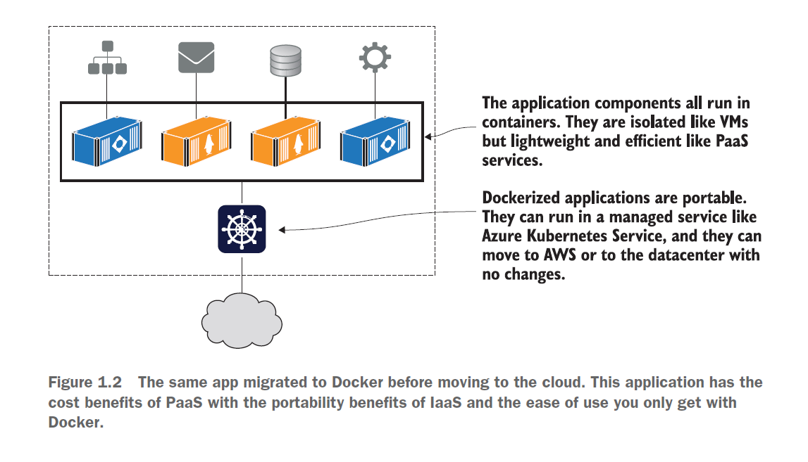
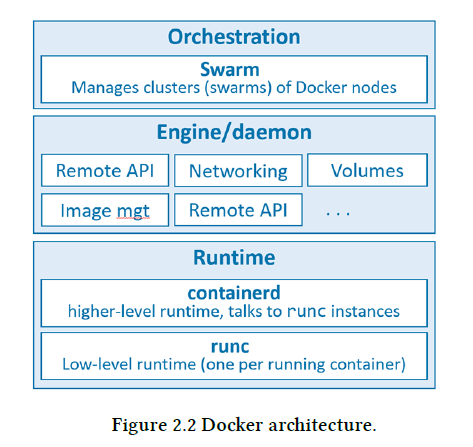

# Intro To Docker

- [Docker Dokumentacija](https://docs.docker.com/)

## Docker overview
- Docker is an **open platform for developing, shipping, and running applications**. 
- Docker is a platform for running applications in lightweight units called containers.
- Docker enables you to **separate your applications from your infrastructure** so you can deliver software quickly. 
    - With Docker, you can manage your infrastructure in the same ways you manage your applications. 
- By taking advantage of Docker’s methodologies for shipping, testing, and deploying code quickly, you can significantly **reduce the delay between writing code and running it in production**.
- Docker is becoming a core competency
for operators and developers across the industry—in the 2019 Stack Overflow survey, Docker polled as **people’s number one “most wanted” technology**.

## Why are containers and Docker so important?
- **Migrating apps to the cloud**
    - Moving apps to the cloud is top of mind for many organizations. -> Manj stroškov, lažje skaliranje, hitrejšideploy novih aplikaciji, ni skrbi z opremo.
    - You migrate each part of your application to a container, and then you can run the whole application in containers using Kubernetes or other cloud services, or on your own Docker cluster in the datacenter.
        - It does take some investment to migrate to containers (Dockerfiles, manifests using the Docker Compose or Kubernetes format.).
    

<!-- Vir: Learn Docker in a Month of Lunches, ELTON STONEMAN -->

- **Modernizing legacy apps**
    - You can run pretty much any app in the cloud in a container, but you won’t get the full value of Docker or the cloud platform if it uses an older, monolithic design.
    - Moving your app to Docker is a great first step to modernizing the architecture, adopting new patterns without needing a full rewrite of the app.
    - Benefits of a microservice architecture.
- **Building new cloud-native apps**
    - Brandnew projects built on cloud-native principles are greatly accelerated with Docker.
- **Technical innovation: Serverless and more**
    - One of the key drivers for modern IT is consistency: teams want to use the same tools, processes, and runtime for all their projects.
    - You can run all your applications—legacy monoliths, new cloud-native apps, and serverless functions—on a single Docker cluster, which could be running in the cloud or the datacenter.
- **Docker provides an abstraction**
    - Instead of focusing on all the complexities and specifics associated with installing an application, all we need to consider is what software we’d like to install.
    - This is also the case for application removal.
- **Protecting your computer**
    - Containers also protect us from the software running inside a container.
    - Like physical jail cells, anything inside a container can access only things that are inside it as well. Exceptions to this rule exist, but only when explicitly created by the user.
- **Improving portability**
    - Portability between operating systems is a major problem for software users.
    - Software running in Docker containers need be written only once against a consistent set of dependencies.
        - That means your desktop, your development environment, your company’s server, and your company’s cloud can all run the same programs.
- **Getting organized**
    - Without Docker, a computer can end up looking like a junk drawer. Applications have all sorts of dependencies. Some applications depend on specific system libraries for common things like sound, networking, graphics, and so on. Others depend on standard libraries for the language they’re written in. Some depend on other applications, such as the way a Java program depends on the Java Virtual Machine, or a web application might depend on a database. It’s common for a running program to require exclusive access to a scarce resource such as a network connection or a file.
    - Docker keeps things organized by isolating everything with containers and images.

## Installing Docker

### Docker Desktop
Docker Desktop is an easy-to-install application for your Mac or Windows environment that enables you to build and share containerized applications and microservices.

Docker Desktop includes:
- Docker Engine
- Docker CLI client
- Docker Compose 
- Docker Content Trust
- Kubernetes
- Credential Helper.

Docker Desktop works with your choice of development tools and languages and gives you access to a vast library of certified images and templates in Docker Hub. This enables development teams to extend their environment to rapidly auto-build, continuously integrate, and collaborate using a secure repository.

> **Update to the Docker Desktop terms**: Commercial use of Docker Desktop in larger enterprises (more than 250 employees OR more than $10 million USD in annual revenue) now requires a paid subscription.

Install Docker Desktop: https://docs.docker.com/get-docker/

### Docker Engine
Docker Engine is an open source containerization technology for building and containerizing your applications. Docker Engine acts as a client-server application with:
- A server with a long-running daemon process dockerd.
- APIs which specify interfaces that programs can use to talk to and instruct the Docker daemon.
- A command line interface (CLI) client docker.

1. [Install Docker Engine on Ubuntu](https://docs.docker.com/engine/install/ubuntu/)
2. [Post-installation steps for Linux](https://docs.docker.com/engine/install/linux-postinstall/)
    - [Optional] Manage Docker as a non-root user -> Security risks!
    - Configure Docker to start on boot

### Differences between Docker Desktop for Linux and Docker Engine

[Docker Desktop for Linux and Docker Engine](https://docs.docker.com/desktop/install/linux-install/#differences-between-docker-desktop-for-linux-and-docker-engine) can be installed side-by-side on the same machine. Docker Desktop for Linux stores containers and images in an isolated storage location within a VM and offers controls to restrict its resources. Using a dedicated storage location for Docker Desktop prevents it from interfering with a Docker Engine installation on the same machine.

### Verifying your Docker setup
First check Docker itself with the docker version command:
- `docker version`

## Running Hello World in a container
You’re going to send a command to Docker, telling it to run a container that
prints out some simple “Hello, World” text.

Enter this command, which will run the Hello World container: `sudo docker container run hello-world` or `sudo docker run hello-world`

> Both commands are exactly the same. Prior to docker 1.13 the docker run command was only available. The CLI commands were then refactored to have the form docker COMMAND SUBCOMMAND, wherein this case the COMMAND is container and the SUBCOMMAND is run.

1. The docker container run command tells Docker to run an application in a container. 
2. This application has already been packaged to run in Docker and has been published on a public site that anyone can access.
3. The container package (which Docker calls an “image”) is named hello-world.
4. The command you’ve just entered tells Docker to run a container from that image.
5. After the echo command prints "hello world" to the terminal, the program exits, and the container is marked as stopped.

Run and check for a container:
- List all running container processes: `sudo docker ps`
- `sudo docker ps -a`

Docker needs to have a copy of the image locally before it can run a container
using the image. The very first time you run this command, you won’t have a copy of the image, and you can see that in the first output line: `unable to find image locally`. Then Docker downloads the image (which Docker calls “pulling”), and you can see that the image has been downloaded.

Now Docker starts a container using that image. The image contains all the content for the application, along with instructions telling Docker how to start the application. The application in this image is just a simple script.

And Docker images can be packaged to **run on any computer that supports Docker**, which makes the app completely portable — **portability is one of Docker’s key benefits.**

Repeat the exact same Docker command: `sudo docker run hello-world`

Docker already has a copy of the image locally so it doesn’t need to download the image first; it gets straight to running the container.

When you use docker run the second time, it creates a second container from the same repository. This means that if you repeatedly use docker run and create a bunch of containers, you’ll need to get a list of the containers you’ve created and maybe at some point destroy them.

Run and check for a container:
- `sudo docker ps`
- `sudo docker ps -a`

Understand that the running state of a container is directly tied to the state of a single running program inside the container. **If a program is running, the container is running. If the program is stopped, the container is stopped.** Restarting a container will run the program again.

Clean: `sudo docker container rm -f $(docker container ls -aq)`

## Example: Running multiple NGINX instances
1. Preverimo ali je na virtualki že zagnan Apache server:
    - Preverimo delovanje: `curl http://127.0.0.1 ali IP virtualke`
    - `sudo systemctl stop apache2.service`
    - `sudo systemctl disable apache2.service`
2. Želimo namesti in stestirati delovanje NGINX instance:
    - `sudo apt-get update`
    - `sudo apt-get install -y nginx`
    - `nginx -v`
    - `sudo systemctl start nginx`
    - `sudo systemctl status nginx`
    - Preverimo delovanje: `curl http://127.0.0.1 ali IP virtualke`
3. Želimo namestiti dve instance NGINX:
    - `sudo apt-get install nginx` - > že obstaja
    - `sudo systemctl start nginx` -> vidmo da še vedno samo ena instanca je delujoča
    - `sudo ps aux | grep nginx`
    - Če želimo namestit dve instance moramo spremeniti init scripte
        - `cat /etc/init/nginx.conf`
    -    To je komplicirani delo, pa še skoraj nemogoče za dve različne verzije
    - Ustavimo:
        - `sudo systemctl stop nginx`
        - `sudo systemctl disable nginx`
    - Problem da ko namestimo mi eno verzijo spodaj imamo odvisnosti ki so različne od verzije. To nam kontejnerji poenostavijo.
4.  Zaženmo NGINX s pomočjo Dockrja:
    - NGINX DockerHub: https://hub.docker.com/_/nginx
    - Prenesemo image lokalno (ta korak ni nujen, če slike ni se zgodi avtomatsko ob zagonu): `docker pull nginx`
        - Uporaba default taga `latest`
        - Zagon 1. instance: `sudo docker run -d nginx`
        - Preverimo ali je up: `sudo docker ps`
        - Pokažemo da se ne moremo še povezat na instanco.
        - Zaženemo drugo in tretjo verzijo NGINXa
            - `sudo docker run -d nginx:1.22.0`
            - `sudo docker run -d nginx:1.14.0`
        - Preverimo ali je up: `sudo docker ps`
        - Pokažemo da se proces vidi na hostu: `sudo ps aux | grep nginx`

> If you don't specify a name, Docker gives a container a random name, such as "stoic_williams," "sharp_bartik," "awesome_murdock," or "evil_hawking." (Stephen Hawking got no love on this one.) These are generated from a list of adjectives and names of famous scientists and hackers. The combination of the names and adjectives is random, except for one case. Want to see what the exception is? Check it out in the [Docker source code](https://github.com/docker/docker/blob/master/pkg/namesgenerator/names-generator.go)

5. Izpostavimo kontejner na internet:
    - `sudo docker run -d -p "80:80" nginx`
    - Preverimo ali je up: `sudo docker ps`
6. Clean: `sudo docker container rm -f $(docker container ls -aq)`

## About Docker Company
Docker is software that runs on Linux and Windows. It creates, manages, and can even orestrate containers. The software is currently built from various tools **from the Moby open-source project**. Docker, Inc. is the company that created the technology and continues to create technologies and solutions.

Docker, Inc. is a San Francisco based technology company founded by French-born American developer and entrepreneur Solomon Hykes.

It’s also interesting to know that the word “Docker” comes from a British expression meaning dock worker — somebody who loads and unloads cargo from ships.

## Docker Architecture
Docker is **written in the Go programming language** and takes advantage of several features of the Linux kernel to deliver its functionality. Docker uses a technology called **namespaces** to provide the isolated workspace called the container. When you run a container, Docker creates a set of namespaces for that container.

These namespaces provide a layer of isolation. Each aspect of a container runs in a separate namespace and its access is limited to that namespace.

Docker uses a **client-server architecture**. 

The Docker client talks to the Docker daemon, which does the heavy lifting of building, running, and distributing your Docker containers. 

The Docker client and daemon can run on the same system, or you can connect a Docker client to a remote Docker daemon. The Docker client and daemon communicate using a REST API, over UNIX sockets or a network interface.

In a default Linux installation, the client talks to the daemon via a local IPC/Unix socket at `/var/run/docker.sock`.

Another Docker client is Docker Compose, that lets you work with applications consisting of a set of containers.

<!-- Vir: https://docs.docker.com/get-started/overview/ -->

A Docker registry stores Docker images. Docker Hub is a public registry that anyone can use, and Docker is configured to look for images on Docker Hub by default. You can even run your own private registry.

When you use the `docker pull` or `docker run` commands, the required images are pulled from your configured registry. When you use the `docker push` command, your image is pushed to your configured registry.

<!-- Vir: Docker Deep Dive, Nigel Poulton -->

- The **runtime** operates at the lowest level and is responsible for starting and stopping containers (this includes building all of the OS constructs such as namespaces and cgroups). Docker implements a tiered runtime architecture with high-level and low-level runtimes that work together.
    - The **low-level runtime** is called `runc` and is the reference implementation of Open Containers Initiative (OCI) runtime-spec. Its job is to interface with the underlying OS and start and stop containers. Every running container on a Docker node has a runc instance managing it.
    - The **higher-level runtime** is called `containerd`. containerd does a lot more than runc. It manages the entire lifecycle of a container, including pulling images, creating network interfaces, and managing lower-level runc instances. containerd is pronounced “container-dee’ and is a graduated CNCF project used by Docker and Kubernetes as a container runtime. A typical Docker installation has a single containerd process (docker-containerd) controlling the runc (dockerrunc) instances associated with each running container.
- The **Docker daemon** (`dockerd`) sits above containerd and performs higher-level tasks such as; exposing the Docker remote API, managing images, managing volumes, managing networks, and more… A major job of the Docker daemon is to provide an easy-to-use standard interface that abstracts the lower levels.
- Docker also has native support for managing clusters of nodes running Docker. These clusters are called swarms and the native technology is called Docker Swarm. Docker Swarm is easy-to-use and many companies are using it in real-world production. However, most people are choosing to use Kubernetes instead of Docker Swarm.

## The Docker Engine (Advanced)

More [here](./The_Docker_Engine_Advanced.md).
