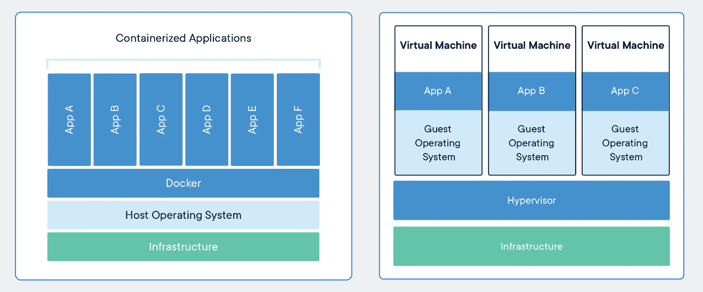
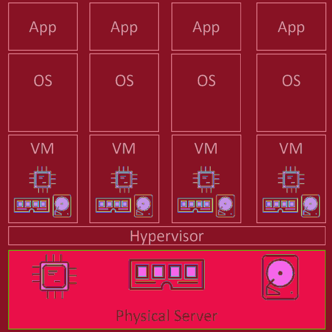
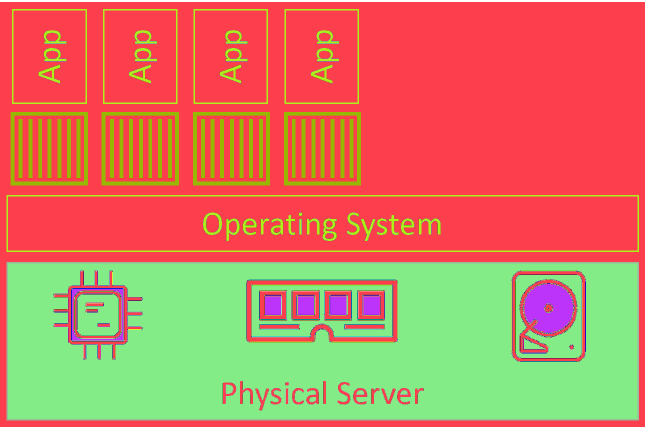
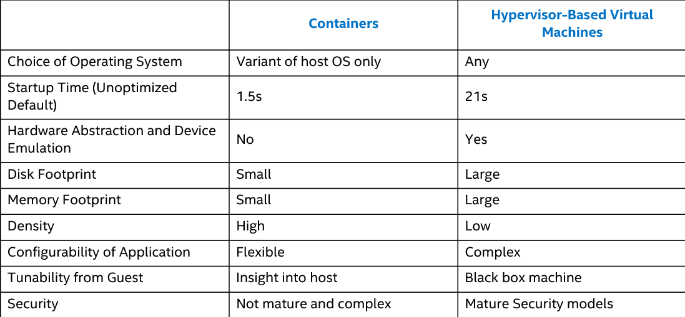
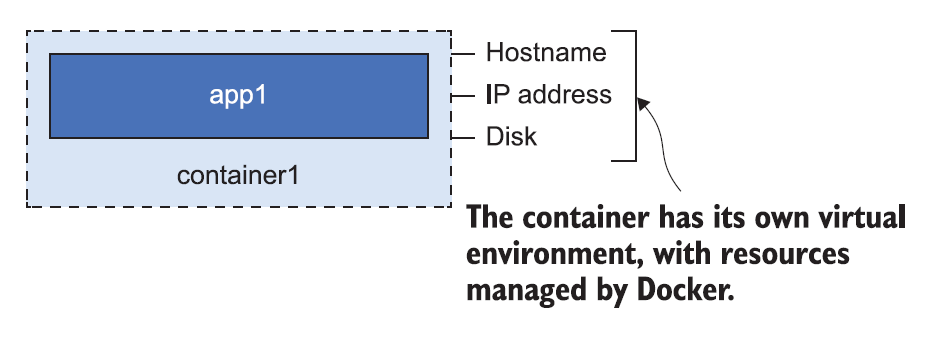

# Containers

## Containers History
- **Applications are at the heart of businesses**. If applications break, businesses break.
- Most applications run on servers. **In the past we could only run one application per server**.
    - Windows and Linux just didn’t have the technologies to safely and securely run multiple applications on the same server.
- Every time the business needed a new application, the IT department would **buy a new server**. Most of the time **nobody knew the performance requirements** of the new application, forcing the IT department to make guesses when choosing the model and size of the server to buy.
- This resulted in over-powered servers operating as low as 5-10% of their potential capacity. A **tragic waste of company capital and environmental resources**.

### Virtual Machines
- VMware, Inc. gave the world a gift - the virtual machine (VM). IT departments no longer needed to procure a brand-new oversized server every time the business needed a new application.
- VMs aren't perfect:
    - Every VM requires its own dedicated operating system (OS).
    - Every OS consumes CPU, RAM and other resources that could otherwise be used to power more applications.
    - Every OS needs patching and monitoring.
    - And in some cases, every OS requires a license.
    - VMs are slow to boot, and portability isn’t great — migrating and moving VM workloads between hypervisors and cloud platforms is harder than it needs to be.
    - Results in wasted time and resources.

### Linux containers
- For a long time, the big web-scale players, like Google, have been using container technologies to address the shortcomings of the VM model.
- In the container model, the container is roughly analogous to the VM. A major difference is that **containers do not require their own full-blown OS**. In fact, all containers on a single host share the host’s OS. This frees up huge amounts of system resources such as CPU, RAM, and storage. It also reduces potential licensing costs and reduces the overhead of OS patching and other maintenance.
- **Containers are also fast to start and ultra-portable**. Moving container workloads from your laptop, to the cloud, and then to VMs or bare metal in your data center is a breeze.
- Modern containers started in the Linux world and are the product of an immense amount of work from a wide variety of people over a long period of time.
- Some of the major technologies that enabled the massive growth of containers in recent years include; kernel namespaces, control groups, union filesystems, and of course Docker.

> There are many operating system virtualization technologies similar to containers that predate Docker and modern containers. Some even date back to System/360 on the Mainframe. BSD Jails and Solaris Zones are some other well-known examples of Unix-type container technologies.

- But for now, it’s enough to say that Docker was the magic that made Linux containers usable. Put another way, Docker, Inc. made containers simple!

## Containers vs Virtual Machines

<!-- Vir: https://www.docker.com/resources/what-container/ -->

**Containers and VMs both need a host to run on.** This can be anything from your laptop, a bare metal server in your data center, all the way up to an instance in the public cloud. In fact, many cloud services now offer the ability to run containers on ephemeral serverless back-ends.

In the **VM model**:
1. The physical server is powered on and the hypervisor boots (we’re skipping the BIOS and bootloader code etc.). 
2. Once booted, the hypervisor lays claim to all physical resources on the system such as CPU, RAM, storage, and NICs. 
3. It then carves these hardware resources into virtual versions that look smell and feel exactly like the real thing. 
4. It then packages them into a software construct called a virtual machine (VM). 
5. We take those VMs and install an operating system and application on each one.

Things are a bit different in the **container model**:
1. The server is powered on and the OS boots. In the Docker world this can be Linux, or a modern version of Windows that supports the container primitives in its kernel. 
2. Similar to the VM model, the OS claims all hardware resources. 
3. On top of the OS, we install a container engine such as Docker. 
4. The container engine then takes OS resources such as the process tree, the filesystem, and the network stack, and carves them into isolated constructs
called containers. 
5. Each container looks smells and feels just like a real OS. 
6. Inside of each container we run an application.

At a high level, **hypervisors perform hardware virtualization** — they carve up physical hardware resources into virtual versions called VMs. On the other hand, **containers perform OS virtualization** — they carve OS resources
into virtual versions called containers.

**Example**
- Let’s assume a requirement where your business has a single physical server that needs to run 4 business applications.
- We’d create 4 VMs, install 4 operating systems, and then install the 4 applications.

<!-- Vir: Docker Deep Dive, Nigel Poulton -->

- We’d carve the OS into 4 containers and run a single application inside each.

<!-- Vir: Docker Deep Dive, Nigel Poulton -->

The container model has a single OS/kernel running on the host. It’s possible to run tens or hundreds of containers on a single host with every container sharing that single OS/kernel. That means a single OS consuming CPU, RAM, and storage. A single OS that needs licensing. A single OS that needs updating and patching. And a single OS kernel presenting an attack surface.

As a container isn’t a full-blown OS, it **starts much faster than a VM**. Remember, there’s no kernel inside of a container that needs locating, decompressing, and initializing — not to mention all of the hardware enumerating and initializing associated with a normal kernel bootstrap.

None of that is needed when starting a container. The **single shared kernel, running on the host machine**, is already started. Net result, containers can start in less than a second. The only thing that has an impact on container start time is the time it takes to start the application it’s running.

You can pack more applications onto less resources, start them faster, and pay less in licensing and admin costs, as well as present less of an attack surface to the dark side.

Well, one thing that’s not so great about the container model is security. Out of the box, containers are less secure and provide less workload isolation than VMs. Technologies exist to secure containers and lock them down, but
at the time of writing, some of them are prohibitively complex.

## What is a container?
A Docker container is the same idea as a physical container — think of it like a box with an application in it. Inside the box, the application seems to have a computer all to itself: it has its **own machine name** and **IP address**, and it also has its **own disk drive** (Windows containers have their own Windows Registry too).

<!-- Vir: Learn Docker in a Month of Lunches, ELTON STONEMAN -->

Those things are all virtual resources—the hostname, IP address, and filesystem are created by Docker. They’re logical objects that are managed by Docker, and they’re all joined together to create an environment where an application can run.

ES - 18
NP DDD - 73, 77

- ugašanje kontejnerja
- procesi v kontejnerju
- Attaching to running containers

- Starting a new container (advanced)