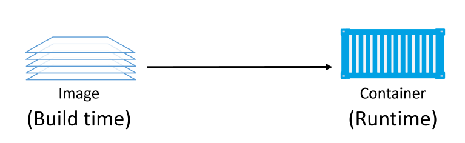
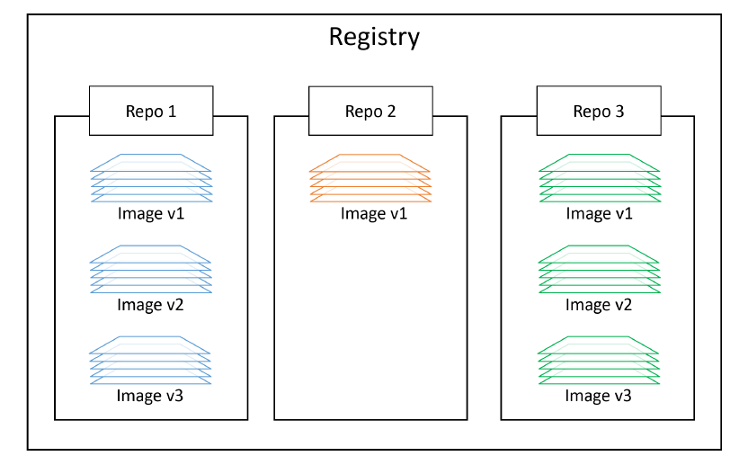

# Docker Images

## About Docker Images
A Docker image is a **unit of packaging that contains everything required for an application to run**. This includes:
- application code
- application dependencies
- OS constructs. 

If you have an application’s Docker image, the only other thing you need to run that application is a computer running Docker.

> You can think of Docker images as similar to VM templates. A VM template is like a stopped VM — a Docker image is like a stopped container.

You get Docker images by **pulling them from an image registry**. The most common registry is Docker Hub, but
others exist. The `pull` operation downloads the image to your local Docker host where Docker can use it to start
one or more containers.

Images are **made up of multiple layers** that are stacked on top of each other and represented as a single object. Inside of the image is a cut-down operating system (OS) and all of the files and dependencies required to run an application. Because containers are intended to be fast and lightweight, **images tend to be small**.

In fact, you can stop a container and create a new image from it. With this in mind:
- **images** are considered `build-time` constructs,
- **containers** are `run-time` constructs.

<!-- Vir: Docker Deep Dive, Nigel Poulton -->

We use the `docker container run` command to start one or more containers from a single image. Once you’ve started a container from an image, the two constructs become dependent on each other and you **cannot delete the image until the last container using it has been stopped** and destroyed. Attempting to delete an image without stopping and destroying all containers using it will result in an error.

## Images are usually small

The whole purpose of a container is to run a **single application or service**. This means it only needs the code and dependencies of the app/service it is running — it does not need anything else. This results in **small images** stripped of all non-essential parts.

For example, Docker images do not ship with 6 different shells for you to choose from. In fact, many application images ship without a shell – if the application doesn’t need **a shell to run it doesn’t need to be included in the image**. General purpose images such as busybox and Ubuntu ship with a shell, but when you package your business applications for production, you will probably package them without a shell.

**Image also don’t contain a kernel — all containers running on a Docker host share access to the host’s kernel**. For these reasons, we sometimes say images contain just enough operating system (usually just OS-related files and filesystem objects).

The official [Alpine Linux Docker image](https://alpinelinux.org/about/) is less than 5MB in size and is an extreme example of how small Docker images can be. Some images are even smaller, however, a more typical example might be something like the official Ubuntu Docker image which is currently about 40MB.

## Pulling images

**A cleanly installed Docker host has no images in its local repository**.

The local image repository on a Linux-based Docker host is usually located at `/var/lib/docker/<storage-driver>`.

You can use the following command to check if your Docker host has any images in its local repository: `sudo docker image ls`

The process of **getting images onto a Docker host is called pulling**. So, if you want the latest Busybox image on your Docker host, you’d have to pull it.
- `sudo docker image pull busybox:latest`
- `sudo docker image pull alpine:latest`
- `sudo docker image pull redis:latest`
- `sudo docker image ls`

As you can see, the images just pulled are now present in the Docker host’s local repository.

## Image registries
We **store images in centralised places called image registries**. This makes it easy to share and access them.

The most common registry is [Docker Hub](https://hub.doer.com). Other registries exist, including 3rd party registries and secure on-premises registries. However, the Docker client is opinionated and defaults to using Docker Hub. 

Run: `sudo docker info`

Docker is configured to use `https://index.docker.io/v1/` as its default registry when pushing and pulling images (this actually redirects to v2).

**Image registries** contain one or more **image repositories.** In turn, image repositories contain one or more **images**.

<!-- Vir: Docker Deep Dive, Nigel Poulton -->

### Official and unofficial repositories
Docker Hub has the concept of official repositories and unofficial repositories.

As the name suggests, **official repositories** are the home to images that have been vetted and curated by Docker, Inc. This means they should contain up-to-date, high-quality code, that is secure, well-documented, and in-line with best practices.

**Unofficial repositories** can be like the wild-west — you should not assume they are safe, well-documented or built according to best practices. That’s not saying everything in unofficial repositories is bad. There’s some excellent stuff in unofficial repositories. You just need to be **very careful before trusting code from them**. To be honest, you should always be careful when trusting software from the internet — even images from official repositories.

Most of the popular applications and base operating systems have their own official repositories on Docker Hub.
They’re easy to spot because they live at the top level of the Docker Hub namespace. The following list contains
a few of the official repositories, and shows their URLs that exist at the top-level of the Docker Hub namespace:    
- nginx: https://hub.docker.com/_/nginx/
- busybox: https://hub.docker.com/_/busybox/
- redis: https://hub.docker.com/_/redis/
- mongo: https://hub.docker.com/_/mongo/

## Image naming and tagging

Addressing images from official repositories is as simple as providing the repository name and tag separated by
a colon (:). The format for docker image pull, when working with an image from an official repository is:
- `sudo docker image pull <repository>:<tag>`

Example: `sudo docker image pull alpine:latest`

If you **do not specify an image tag after the repository name**, Docker will assume you are referring to the image tagged as `latest`. If the repository doesn’t have an image tagged as latest the command will fail.

The latest tag doesn’t have any magical powers. Just because an image is tagged as latest does not guarantee it is the most recent image in a repository. For example, the most recent image in the alpine repository is usually tagged as edge. Moral of the story — **take care when using the latest tag.**

Pulling images from an unofficial repository is essentially the same — you just need to prepend the repository name with a Docker Hub username or organization name. 

Example: `sudo docker image pull bitnami/postgresql:14`

If you want to **pull images from 3rd party registries** (not Docker Hub), you need to prepend the repository
name with the DNS name of the registry. For example, the following command pulls the 3.1.5 image from the
google-containers/git-sync repo on the Google Container Registry (gcr.io).
- `sudo docker image pull gcr.io/google-containers/git-sync:v3.1.5`

Notice how the pull experience is exactly the same from Docker Hub and the Google Container Registry.

A **single image can have as many tags as you want**. This is because tags are arbitrary alpha-numeric values that are stored as metadata alongside the image ([example](https://hub.docker.com/_/python)). `latest` is an arbitrary tag and is not guaranteed to point to the newest image in a repository.

## Filtering the images on the host

