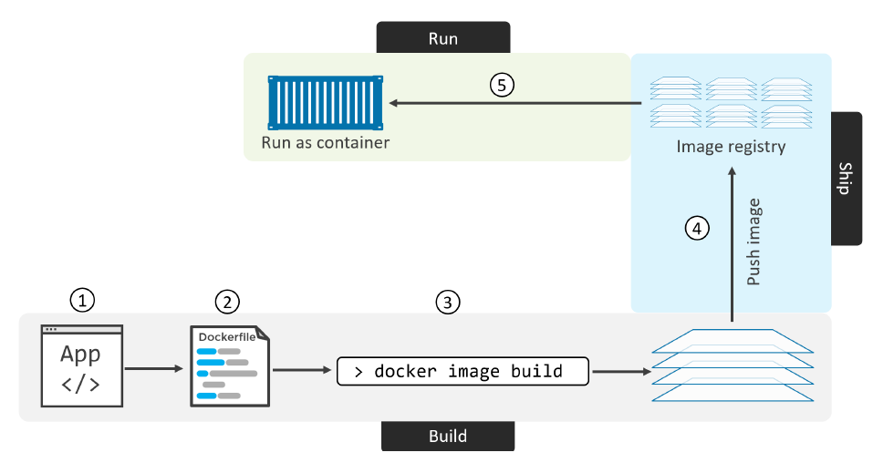
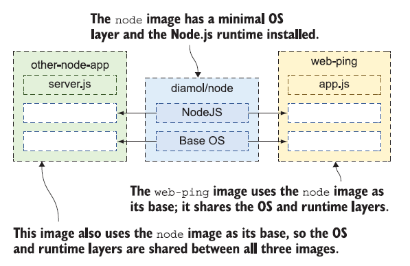

# Building Images

## Containerizing an app - overview
The process of taking an application and configuring it to run as a container is called “containerizing”.

The process of containerizing an app looks like this:
1. Start with your application code and dependencies
2. Create a `Dockerfile` that describes your app, its dependencies, and how to run it
3. Feed the `Dockerfile` into the docker image build command
4. Push the new image to a registry (optional)
5. Run container from the image

Once your app is containerized (made into a container image), you’re ready to share it and run it as a container.


<!-- Vir: Docker Deep Dive, Nigel Poulton -->

You can create a Docker image by either modifying an existing image inside a
container or defining and executing a build script called a Dockerfile.

## Building your first container image

The **Dockerfile is a simple script you write to package up an application—it’s a set of instructions, and a Docker image is the output**.

Dockerfile syntax is simple to learn, and you can package up any kind of app using a Dockerfile. As scripting languages go, it is very flexible. Common tasks have their own commands, and for anything custom you need to do, you can use standard shell commands.

Dockerfile to package up the web-ping application:

```Dockerfile
FROM node:18-alpine

ENV TARGET="ltfe.org"
ENV METHOD="HEAD"
ENV INTERVAL="3000"

WORKDIR /web-ping
COPY app.js .

CMD ["node", "/web-ping/app.js"]
```

The Dockerfile instructions are FROM, ENV, WORKDIR, **`COPY`**, and CMD; they’re in capitals, but that’s a convention, not a requirement. Here’s the breakdown for each instruction:
- [**`FROM`**](https://docs.docker.com/engine/reference/builder/#from) — Every image has to start from another image. In this case, the web-ping image will use the `node:18-alpine` image as its starting point. This will set the base image for your Dockerfile, which means that subsequent instructions will be applied to this base image. That image has Node.js installed, which is everything the web-ping application needs to run.
- [**`ENV`**](https://docs.docker.com/engine/reference/builder/#env) — Sets values for environment variables. The syntax is `[key]="[value]"`, and there are three ENV instructions here, setting up three different environment variables.
> The environment variables set using `ENV` will persist when a container is run from the resulting image. You can view the values using `docker inspect`, and change them using `docker run --env <key>=<value>`.
- [**`WORKDIR`**](https://docs.docker.com/engine/reference/builder/#workdir) — Creates a directory in the container image filesystem, and sets that to
be the current working directory. If not specified, the default working directory is `/`. In practice, if you aren’t building a Dockerfile from scratch (FROM scratch), the WORKDIR may likely be set by the base image you’re using.Therefore, to avoid unintended operations in unknown directories, it is best practice to set your WORKDIR explicitly.
- [**`COPY`**](https://docs.docker.com/engine/reference/builder/#copy) — Copies files or directories from the local filesystem into the container
image. The syntax is `[source path] [target path]` — in this case, I’m copying
`app.js` from my local machine into the working directory in the image.
- [**`CMD`**](https://docs.docker.com/engine/reference/builder/#cmd) — Specifies the command to run when Docker starts a container from the
image. This runs Node.js, starting the application code in app.js.

> Understanding Dockerfile instructions is not enough to create your Dockerfile, because **you need to also understand the context of the technology** you are building for.

Navigate to the source directory (from docker-k8s folder):
- `cd 06_Building_Images/examples/01_ping_app`
- `ls -la`

You should see that you have two files:
- `Dockerfile` (no file extension)
- `app.js`, which has the Node.js code for the web-ping application

In this directory you have everything you need to build your own image for the
web-ping application.

Docker needs to know a few things before it can build an image from a Dockerfile. It needs:
- a **name for the image**, 
- and it needs to know the **location for all the files** that it’s going to package into the image.
- `sudo docker image build --tag web-ping .`

The `--tag` argument is the name for the image, and the final argument is the directory where the Dockerfile and related files are. Docker calls this directory the “context,” and the period means “use the current directory.”

When you see the “successfully built” and “successfully tagged” messages in the
output, your image is built. It’s stored **locally in your image cache**, and you can see it with the Docker command to list images.
- `sudo docker image ls 'w*'`

**Environment variables** are just key/value pairs that the operating system provides. Docker containers also have environment variables, but
instead of coming from the computer’s operating system, they’re set up by Docker in the same way that Docker creates a hostname and IP address for the container.

Run a container from your own image to ping Docker’s website every five seconds:
- `sudo docker container run --rm -e TARGET=docker.com -e INTERVAL=5000 web-ping`

The container running interactively because you didn’t use the `--detach` flag, so the output from the app is shown on your console. The container will keep running until you end the app by pressing Ctrl-C.

## Understanding Docker images and image layers

The Docker image contains all the files you packaged, which become the container’s filesystem, and it also contains a lot of metadata about the image itself. That includes a **brief history** of how the image was built. Check the history for your web-ping image:
- `sudo docker image history web-ping`

The `CREATED BY` commands are the Dockerfile instructions—there’s a one-to-one relationship, so each line in the Dockerfile creates an image layer.

A Docker image is a logical collection of image layers. Layers are the files that are physically stored in the Docker Engine’s cache. Here’s why that’s important: **image layers can be shared between different images and different containers**. If you have lots of containers all running Node.js apps, they will all share the same set of image layers that contain the Node.js runtime.


<!-- Vir: Learn Docker in a Month of Lunches, ELTON STONEMAN -->

You can list images with `docker image ls`, which also **shows the size of the image**. If you don’t include a filter in the command, you’ll see all
images: 
- `sudo docker image ls`
 
It looks like all the Node.js images take up the same amount of space — 167MB MB each on Linux.

The size column you see is the logical size of the image—that’s how much disk space the image would use if you didn’t have any other images on your system. If you do **have other images that share layers**, the **disk space Docker uses is much smaller**.

The `system df` command shows exactly how much disk space Docker is using:
- `sudo docker system df`

The amount of disk space you save through reuse is typically much larger when you have a large number of application images all sharing the same base layers for the runtime.

Docker enforces that by making **image layers read-only**. Once you create a layer by building an image, that layer **can be shared by other images, but it can’t be changed.**

## Understanding the image layer cache

There’s a layer of your web-ping image that contains the application’s JavaScript file. If you **make a change to that file and rebuild your image, you’ll get a new image layer**.

Docker assumes the layers in a Docker image follow a defined sequence, so if you change a layer in the middle of that sequence, Docker doesn’t assume it can reuse the later layers in the sequence.

Make a change to the `app.js` file. It doesn’t have to be a code change; just adding a new empty line at the end of the file will do.
- Add a new empty line
- `sudo docker image build -t web-ping:v2 .`

> If you need a full rebuild, you can use the `--no-cache` flag on docker image build to disable the use of the cache.

Steps 2 through 5 of the **build use layers from the cache**, and steps 6 and 7 generate **new layers**.

> Only the instructions `RUN`, `COPY`, `ADD` create layers. Other instructions create temporary intermediate images, and do not increase the size of the build.

Dockerfile instruction results in an image layer, but if the instruction doesn’t change between builds, and the content going into the instruction is the same, Docker knows it can use the previous layer in the cache. 

Docker calculates whether the input has a match in the cache by **generating a
hash**, which is like a digital fingerprint **representing the input**.

The hash is made from the Dockerfile instruction and the contents of any files being copied. If there’s no match for the hash in the existing image layers, Docker executes the instruction, and that breaks the cache. **As soon as the cache is broken**, Docker **executes all the instructions that follow, even if they haven’t changed**.

Any Dockerfile you write should be **optimized so that the instructions are ordered by how frequently they change** — with instructions that are unlikely to change at the start of the Dockerfile, and instructions most likely to change at the end.

Example simpleweb (build the example step by step):
- `cd 06_Building_Images/examples/02_simpleweb/`
- Try without COPY, only one COPY.
- Check the final Dockerfile: `cat Dockerfile`
    - [**`RUN`**](https://docs.docker.com/engine/reference/builder/#run) - The RUN instruction will execute any commands in a new layer on top of the current image and commit the results. The resulting committed image will be used for the next step in the Dockerfile. 
    - [**`EXPOSE`**](https://docs.docker.com/engine/reference/builder/#expose) - The instruction informs Docker that the container listens on the specified network ports at runtime. You can specify whether the port listens on TCP or UDP, and the default is TCP if the protocol is not specified. The EXPOSE instruction does not actually publish the port. It functions as a type of documentation between the person who builds the image and the person who runs the container, about which ports are intended to be published.
    - [**`ENTRYPOINT`**](https://docs.docker.com/engine/reference/builder/#entrypoint) - An ENTRYPOINT allows you to configure a container that will run as an executable.
- Build the image:
    - `sudo docker build -t simpleweb .`
    - `sudo docker run --rm simpleweb` (webpage not up -> why?)
    - Try with port mapping: `sudo docker run --rm -p 80:8080 simpleweb`

## Understand how CMD and ENTRYPOINT interact
- https://docs.docker.com/engine/reference/builder/#understand-how-cmd-and-entrypoint-interact
- stara gradiva

## Difference between the COPY and ADD commands
- https://www.geeksforgeeks.org/difference-between-the-copy-and-add-commands-in-a-dockerfile/
- https://docs.docker.com/develop/develop-images/dockerfile_best-practices/#add-or-copy

## Using the VOLUME command inside Dockerfiles
-> ES 80

However, it’s also possible to deploy volumes via Dockerfiles using the VOLUME instruction. The format is VOLUME `<container-mount-point>`. Interestingly, you cannot specify a directory on the host when defining a volume in a Dockerfile. is is because host directories are different depending on what OS your Doer host is running
– it could break your builds if you specified a directory on a Doer host that doesn’t exist. As a result, defining
a volume in a Doerfile requires you to specify host directories at deploy-time.

Anonymous volumes have no specific source so when the container is deleted, instruct the Docker Engine daemon to remove them.
- https://docs.docker.com/storage/volumes/#remove-anonymous-volumes

When you mount a volume, it may be named or anonymous. Anonymous volumes are not given an explicit name when they are first mounted into a container, so Docker gives them a random name that is guaranteed to be unique within a given Docker host. Besides the name, named and anonymous volumes behave in the same ways.

## Best practices for writing Dockerfiles
- https://docs.docker.com/develop/develop-images/dockerfile_best-practices/#dockerfile-instructions
- https://docs.docker.com/develop/dev-best-practices/
- stara gradiva
- NP 104

## Example: Build a Python application
- stara gradiva
- https://docs.docker.com/language/python/build-images/

## Use multi-stage builds
- ES 45
- NP 101
- https://docs.docker.com/develop/develop-images/multistage-build/

## More best practices for writing Dockerfiles (Advanced) 

[More here](./Best_practices_for_writing_Dockerfiles/Best_practices_for_writing_Dockerfiles.md).

## Building Docker images from a container (Advanced)

[More here](./Building_Docker_images_from_a_container_Advanced.md).

## Build images with BuildKit (Advanced)
- https://docs.docker.com/develop/develop-images/build_enhancements/