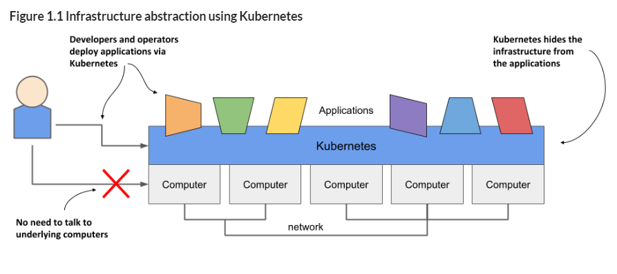
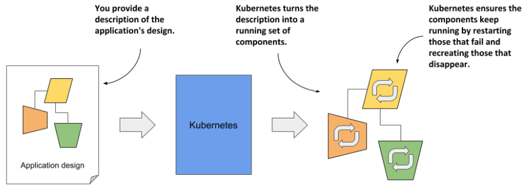
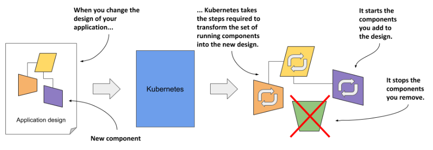
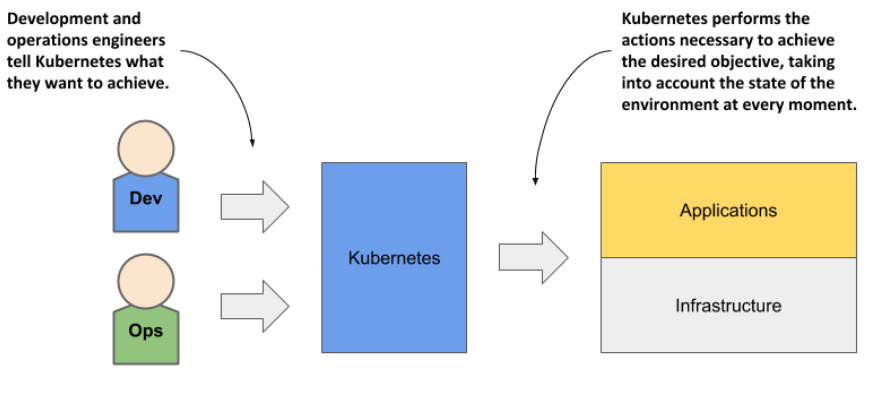

# Introduction to Kubernetes

## About Kubernetes

The word Kubernetes is **Greek for pilot or helmsman**, the person who steers the ship - the person standing at the helm (the ship’s wheel). A helmsman is not necessarily the same as a captain. A captain is responsible for the ship, while the helmsman is the one who steers it. Kubernetes steers your applications and reports on their status while you - the captain - decide where you want the system to go.

> HOW TO PRONOUNCE KUBERNETES AND WHAT IS K8S? The correct Greek pronunciation of Kubernetes, which is `Kie-ver-nee-tees`, is different from the English pronunciation you normally hear in technical conversations. Most often it’s `Koo-ber-netties` or `Koo-ber-nay’-tace`, but you may also hear `Koo-ber-nets`, although rarely. In both written and oral conversations, it’s also referred to as Kube or K8s, pronounced Kates, where the 8 signifies the number of letters omitted between the first and last letter.

**Kubernetes is a software system for automating the deployment and management of complex, large-scale application systems composed of computer processes running in containers.**

Main Kubernetes features:
- **Abstracting away the infrastructure**: When software developers or operators decide to deploy an application, they do this through Kubernetes instead of deploying the application to individual computers. Kubernetes provides an abstraction layer over the underlying hardware to both users and applications.

<!-- Vir: https://livebook.manning.com/book/kubernetes-in-action-second-edition/chapter-1/v-14/17 -->
- **Standardizing how we deploy applications**: Because the details of the underlying infrastructure no longer affect the deployment of applications, you deploy applications to your corporate data center in the same way as you do in the cloud. A single manifest that describes the application can be used for local deployment and for deploying on any cloud provider. All differences in the underlying infrastructure are handled by Kubernetes, so you can focus on the application and the business logic it contains.
- **Deploying applications declaratively**: Kubernetes uses a declarative model to define an application. You describe the components that make up your application and Kubernetes turns this description into a running application. It then keeps the application healthy by restarting or recreating parts of it as needed. Whenever you change the description, Kubernetes will take the necessary steps to reconfigure the running application to match the new description. 

<!-- Vir: https://livebook.manning.com/book/kubernetes-in-action-second-edition/chapter-1/v-14/17 -->

<!-- Vir: https://livebook.manning.com/book/kubernetes-in-action-second-edition/chapter-1/v-14/17 -->
- **Taking on the daily management of applications**: As soon as you deploy an application to Kubernetes, it takes over the daily management of the application. If the application fails, Kubernetes will automatically restart it. The engineers responsible for operating the system can focus on the big picture instead of wasting time on the details. 

<!-- Vir: https://livebook.manning.com/book/kubernetes-in-action-second-edition/chapter-1/v-14/17 -->

## Kubernetes history
Kubernetes was **originally developed by Google**. Google has practically always run applications in containers. As early as 2014, it was reported that **they start two billion containers every week**. That’s over **3,000 containers per second**, and the figure is much higher today (they run around 900,000 servers). They run these containers on thousands of computers distributed across dozens of data centers around the world.

- **About Borg and Omega - the predecessors of Kubernetes**: Over the years, Google developed an internal system called Borg (and later a new system called Omega) that helped both application developers and operators manage these thousands of applications and services.
- Based on the experience they gained while developing Borg, Omega and other internal systems, **in 2014 Google introduced Kubernetes, an open-source project** that can now be used and further improved by everyone.
- Several companies are now offering enterprise-quality Kubernetes products that are built from the open-source project. These include Red Hat OpenShift, Pivotal Container Service, Rancher and many others.
- Kubernetes has also spawned many other related open-source projects, most of which are now under the umbrella of the **Cloud Native Computing Foundation (CNCF)**, which is part of the Linux Foundation.
- CNCF organizes several **KubeCon** - CloudNativeCon conferences per year - in North America, Europe and China.
    - [CNCF [Cloud Native Computing Foundation]](https://www.youtube.com/c/cloudnativefdn): Videos form the conference

## Understanding Kubernetes
Kubernetes is a **platform for running containers**. It takes care of starting your containerized applications, rolling out updates, maintaining service levels, scaling to meet demand, securing access, and much more.

## Kubernetes architecture

## Kubernetes principles of operation

## Kubernetes versions

## Install Kubernetes
All the major cloud services offer a managed Kubernetes service, and you can run Kubernetes in a data center or on your laptop.

A Kubernetes cluster can have hundreds of nodes, but for our exercises, a
single-node cluster is fine. Dozens of Kubernetes platforms are available:
- Cloud providers (Microsoft Azure AKS, AWS Elastic Kubernetes Service)
- [Docker Desktop](https://docs.docker.com/desktop/): which is a single package that gives you Docker and Kubernetes and all the command-line tools. Docker Desktop is supported on Windows 10 and macOS. 
- Single-node cluster on Linux machine or a Linux VM:
    - [**Kind**](https://kind.sigs.k8s.io/): kind is a tool for running local Kubernetes clusters using Docker container “nodes”. kind was primarily designed for testing Kubernetes itself, but may be used for local development or CI.
    - [**minikube**](https://minikube.sigs.k8s.io/docs/start/): minikube is local Kubernetes, focusing on making it easy to learn and develop for Kubernetes.
    - [**K3s**](https://docs.k3s.io/):
        - Lightweight Kubernetes. Easy to install, half the memory, all in a binary of less than 100 MB.
        - K3s is a fully compliant Kubernetes distribution.
        - The name is a play on “K8s,” which is an abbreviation of Kubernetes. K3s trims the Kubernetes codebase, and the name indicates that it’s half the size of K8s.

### K3s installation

curl -sfL https://get.k3s.io | sh -s - --docker --disable=traefik --writekubeconfig-mode=644

Run the following command to check that your cluster is up
and running: `sudo kubectl get nodes`

It’s a list of all the nodes in your cluster, with some basic details like the status and Kubernetes version.