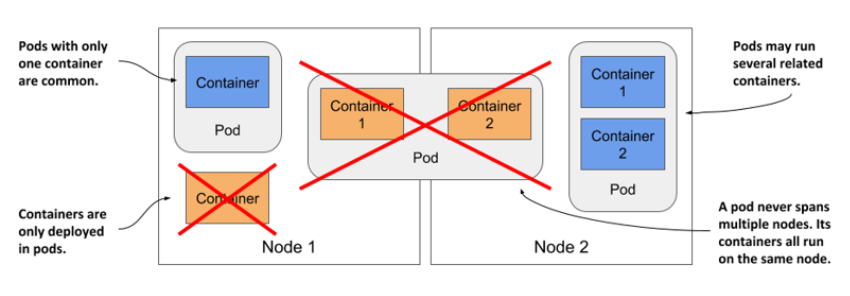

# Kubernetes Pods

## Pod theory
- The atomic unit of scheduling in the virtualization world is the **Virtual Machine (VM)**. This means deploying applications in the virtualization world is done by scheduling them on VMs.
- In the Docker world, the atomic unit is the **container**. This means deploying applications on Docker is done by scheduling them inside of containers.
- In the Kubernetes world, the atomic unit is the Pod. Ergo, deploying applications on Kubernetes means stamping them out in **Pods**.

A Pod is the **basic execution unit of a Kubernetes application–the smallest and simplest unit in the Kubernetes object model that you create or deploy**. - A Pod represents processes running on your Cluster.
- Kubernetes wraps the container in the Pod.
- A Pod is a unit of compute, which runs on a **single node** in the cluster.
- A Pod is a shared execution environment for **one or more containers**.
- All the containers in a Pod are part of the **same virtual environment**, so they share the **same network address** and can **communicate using localhost**.

## Multi-container Pods

You normally run a single container in a Pod, but you can run multiple containers in one Pod, which opens up some interesting deployment options.

When a pod has multiple containers, **all of them run on the same worker node — a single pod instance never spans multiple nodes**.

<!-- Vir: https://livebook.manning.com/book/kubernetes-in-action-second-edition/chapter-5/v-14/12 -->

An application-centric use-case for multi-container Pods is co-scheduling tightly-coupled workloads. For
example, two containers that share memory won’t work if they are scheduled on different nodes in the cluster.
By putting both containers inside the same Pod, you ensure that they are scheduled to the same node and share
the same execution environment.

An infrastructure-centric use-case for multi-container Pods is a service mesh. In the service mesh model, a proxy
container is inserted into every application Pod. This proxy container handles all network traffic entering and
leaving the Pod, meaning it is ideally placed to implement features such as traffic encryption, network telemetry,
intelligent routing, and more.

