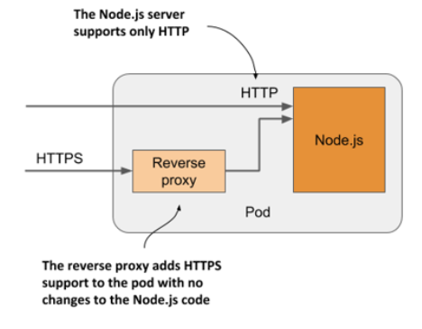

# Kubernetes Pods

## Pod theory
- The atomic unit of scheduling in the virtualization world is the **Virtual Machine (VM)**. This means deploying applications in the virtualization world is done by scheduling them on VMs.
- In the Docker world, the atomic unit is the **container**. This means deploying applications on Docker is done by scheduling them inside of containers.
- In the Kubernetes world, the atomic unit is the **Pod**. Ergo, deploying applications on Kubernetes means stamping them out in Pods.

A Pod is the **basic execution unit of a Kubernetes application–the smallest and simplest unit in the Kubernetes object model that you create or deploy**. - A Pod represents processes running on your Cluster.
- Kubernetes wraps the container in the Pod.
- A Pod is a unit of compute, which runs on a **single node** in the cluster.
- A Pod is a shared execution environment for **one or more containers**.

## Understanding pods
Pod is a co-located group of containers and the basic building block in Kubernetes.

You normally run a single container in a Pod, but you can run multiple containers in one Pod, which opens up some interesting deployment options.

When a pod has multiple containers, **all of them run on the same worker node — a single pod instance never spans multiple nodes**.

<!-- Vir: https://livebook.manning.com/book/kubernetes-in-action-second-edition/chapter-5/v-14/12 -->

### One container shouldn’t contain multiple processes
Imagine an application that consists of several processes that communicate with each other via IPC (Inter-Process Communication) or shared files, which requires them to run on the same computer. You can run all the processes that make up an application in just one container, but that makes the container **very difficult to manage**.

Containers are **designed to run only a single process**, not counting any child processes that it spawns (problems - loggging to standard output, container runtime only restarts the container when the container’s root process dies). Both container tooling and Kubernetes were developed around this fact.
- Problems with logging to the standard output.
- Container runtime only restarts the container when the container’s root process dies.

### How a pod combines multiple containers
With a pod, you can run closely related processes together, giving them (almost) the same environment as if they were all running in a single container.

All containers in a pod **share the same Network namespace** and thus the network interfaces, **IP address(es) and port space** that belong to it.

<!-- Vir: https://livebook.manning.com/book/kubernetes-in-action-second-edition/chapter-5/v-14/12 -->

- Processes running in containers of the same pod can’t be bound to the same port numbers.
- All the containers in a pod also see the **same system hostname**, because they share the UTS namespace, and can **communicate through the usual IPC mechanisms** because they share the IPC namespace.
- A pod **can also be configured to use a single PID namespace** for all its containers, which makes them share a single process tree, but you must explicitly enable this for each pod individually.

> When containers of the same pod use separate PID namespaces, they can’t see each other or send
process signals like SIGTERM or SIGINT between them.

- Each container always has its own Mount namespace, giving it **its own file system**, but when two containers must share a part of the file system, you can add a volume to the pod and mount it into both containers

### Splitting a multi-tier application stack into multiple pods
- You typically run only one application in each pod.
- You never need to combine multiple applications in a single pod, as pods **have almost no resource overhead**.

Imagine a simple system composed of a **front-end web server and a back-end database**. You shouldn’t run them in the same pod:
- If you have a two-node cluster and only create this one pod, you are using only a single worker node and aren’t **taking advantage of the computing resources** available on the second node. This means wasted CPU, memory, disk storage and bandwidth.
- **Splitting into multiple pods to enable individual scaling**: A pod is a basic unit of scaling. Kubernetes doesn’t replicate containers within a pod. It replicates the entire pod. If a container has to be scaled separately from the other components, this is a clear indication that it must be deployed in a separate pod.

<!-- Vir: https://livebook.manning.com/book/kubernetes-in-action-second-edition/chapter-5/v-14/12 -->

## Sidecar containers
Placing several containers in a single pod is only appropriate if the application consists of a primary process and one or more processes that complement the operation of the primary process. **The container in which the complementary process runs is called a sidecar container**.

<!-- Vir: https://livebook.manning.com/book/kubernetes-in-action-second-edition/chapter-5/v-14/12 -->

Examples:
- A reverse proxy that converts HTTPS traffic to HTTP

<!-- Vir: https://livebook.manning.com/book/kubernetes-in-action-second-edition/chapter-5/v-14/12 -->
- A sidecar container that delivers content to the web server container via a volume. The other container in the pod is an agent that periodically downloads content from an external source and stores it in the web server’s webroot directory. 

<!-- Vir: https://livebook.manning.com/book/kubernetes-in-action-second-edition/chapter-5/v-14/12 -->
- Other examples of sidecar containers are log rotators and collectors, data processors, communication adapters, and others.

When deciding whether to use the sidecar pattern and place containers in a single pod, or to place them in separate pods, ask yourself the following questions:
- Do these containers have to run on the same host?
- Do I want to manage them as a single unit?
- Do they form a unified whole instead of being independent components?
- Do they have to be scaled together?
- Can a single node meet their combined resource needs?

If the answer to all these questions is yes, put them all in the same pod. As a rule of thumb, **always place containers in separate pods unless a specific reason requires them to be part of the same pod.**

## Creating pods

