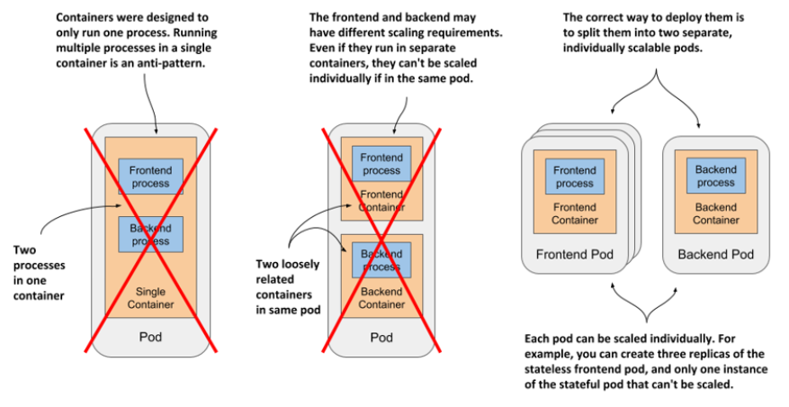

# Kubernetes Pods

## Pod theory
- The atomic unit of scheduling in the virtualization world is the **Virtual Machine (VM)**. This means deploying applications in the virtualization world is done by scheduling them on VMs.
- In the Docker world, the atomic unit is the **container**. This means deploying applications on Docker is done by scheduling them inside of containers.
- In the Kubernetes world, the atomic unit is the **Pod**. Ergo, deploying applications on Kubernetes means stamping them out in Pods.

A Pod is the **basic execution unit of a Kubernetes application–the smallest and simplest unit in the Kubernetes object model that you create or deploy**. 
- A Pod represents processes running on your Cluster.
- Kubernetes wraps the container in the Pod.
- A Pod is a unit of compute, which runs on a **single node** in the cluster.
- A Pod is a shared execution environment for **one or more containers**.

## Understanding pods
Pod is a co-located group of containers and the basic building block in Kubernetes.

You normally run a single container in a Pod, but you can run multiple containers in one Pod, which opens up some interesting deployment options.

When a pod has multiple containers, **all of them run on the same worker node — a single pod instance never spans multiple nodes**.

<!-- Vir: https://livebook.manning.com/book/kubernetes-in-action-second-edition/chapter-5/v-14/12 -->

### One container shouldn’t contain multiple processes
Imagine an application that consists of several processes that communicate with each other via IPC (Inter-Process Communication) or shared files, which requires them to run on the same computer. You can run all the processes that make up an application in just one container, but that makes the container **very difficult to manage**.

Containers are **designed to run only a single process**, not counting any child processes that it spawns (problems - loggging to standard output, container runtime only restarts the container when the container’s root process dies). Both container tooling and Kubernetes were developed around this fact.
- Problems with logging to the standard output.
- Container runtime only restarts the container when the container’s root process dies.

### How a pod combines multiple containers
With a pod, you can run closely related processes together, giving them (almost) the same environment as if they were all running in a single container.

All containers in a pod **share the same Network namespace** and thus the network interfaces, **IP address(es) and port space** that belong to it.

<!-- Vir: https://livebook.manning.com/book/kubernetes-in-action-second-edition/chapter-5/v-14/12 -->

- Processes running in containers of the same pod can’t be bound to the same port numbers.
- All the containers in a pod also see the **same system hostname**, because they share the UTS namespace, and can **communicate through the usual IPC mechanisms** because they share the IPC namespace.
- A pod **can also be configured to use a single PID namespace** for all its containers, which makes them share a single process tree, but you must explicitly enable this for each pod individually.

> When containers of the same pod use separate PID namespaces, they can’t see each other or send
process signals like SIGTERM or SIGINT between them.

- Each container always has its own Mount namespace, giving it **its own file system**, but when two containers must share a part of the file system, you can add a volume to the pod and mount it into both containers

### Splitting a multi-tier application stack into multiple pods
- You typically run only one application in each pod.
- You never need to combine multiple applications in a single pod, as pods **have almost no resource overhead**.

Imagine a simple system composed of a **front-end web server and a back-end database**. You shouldn’t run them in the same pod:
- If you have a two-node cluster and only create this one pod, you are using only a single worker node and aren’t **taking advantage of the computing resources** available on the second node. This means wasted CPU, memory, disk storage and bandwidth.
- **Splitting into multiple pods to enable individual scaling**: A pod is a basic unit of scaling. Kubernetes doesn’t replicate containers within a pod. It replicates the entire pod. If a container has to be scaled separately from the other components, this is a clear indication that it must be deployed in a separate pod.

<!-- Vir: https://livebook.manning.com/book/kubernetes-in-action-second-edition/chapter-5/v-14/12 -->

## Sidecar containers
Placing several containers in a single pod is only appropriate if the application consists of a primary process and one or more processes that complement the operation of the primary process. **The container in which the complementary process runs is called a sidecar container**.

<!-- Vir: https://livebook.manning.com/book/kubernetes-in-action-second-edition/chapter-5/v-14/12 -->

Examples:
- A reverse proxy that converts HTTPS traffic to HTTP

<!-- Vir: https://livebook.manning.com/book/kubernetes-in-action-second-edition/chapter-5/v-14/12 -->
- A sidecar container that delivers content to the web server container via a volume. The other container in the pod is an agent that periodically downloads content from an external source and stores it in the web server’s webroot directory. 

<!-- Vir: https://livebook.manning.com/book/kubernetes-in-action-second-edition/chapter-5/v-14/12 -->
- Other examples of sidecar containers are log rotators and collectors, data processors, communication adapters, and others.

When deciding whether to use the sidecar pattern and place containers in a single pod, or to place them in separate pods, ask yourself the following questions:
- Do these containers have to run on the same host?
- Do I want to manage them as a single unit?
- Do they form a unified whole instead of being independent components?
- Do they have to be scaled together?
- Can a single node meet their combined resource needs?

If the answer to all these questions is yes, put them all in the same pod. As a rule of thumb, **always place containers in separate pods unless a specific reason requires them to be part of the same pod.**

## Creating pods
Pods and other Kubernetes objects are usually created by creating a JSON or YAML manifest file and posting it to the Kubernetes API.

> The decision whether to use YAML or JSON to define your objects is yours. Most people prefer to use
YAML because it’s slightly more human-friendly and allows you to add comments to the object definition.

By using YAML files to define the structure of your application, you don’t need shell scripts to
make the process of deploying your applications repeatable, and you can **keep a history of all
changes** by storing these files in a VCS (Version Control System).

### Creating a YAML manifest for a pod
Now create an object manifest from scratch.
- `cd ~/docker-k8s/18_Kubernetes_Pods/examples/`
- `cat 01_example.yaml`

After you’ve prepared the manifest file for your pod, you can now create the object by posting the file to the Kubernetes API.

When you post the manifest to the API, you are directing Kubernetes to apply the manifest to the cluster.
- `kubectl apply -f 01_example.yaml`

The `kubectl apply` command is used for creating objects as well as for making changes to existing objects.

> If you later decide to make changes to your pod object, you can simply edit the file and run the apply command again. Some of the pod’s fields aren’t mutable, so the update may fail, but you can always delete the pod and then create it again.
- `kubectl get pod myapp -o yaml`

Let’s use the basic kubectl commands to see how the pod is doing:
- `kubectl get pod`
- `kubectl get pod -o wide`
- `kubectl describe pod myapp`

The following listing shows all the events that were logged after creating the pod.
- `kubectl get events`

No warning events are displayed, so everything seems to be fine.

Let’s confirm that the application running in the container
responds to your requests.

For development, testing and debugging purposes, you may want to
communicate directly with a specific pod, rather than using a service that forwards connections to randomly selected pods.

You’ve learned that each pod is assigned its own IP address where it can be accessed by every other pod in the cluster. This IP address is typically internal to the cluster. You can’t access it from your local computer, except when Kubernetes is deployed in a specific way.
1. GETTING THE POD’S IP ADDRESS:
    - You can get the pod’s IP address by retrieving the pod’s full YAML and searching for the podIP field in the status section.
    - `kubectl get pod myapp -o wide`
2. GETTING THE PORT THE APPLICATION IS BOUND TO:
    - If I wasn’t the author of the application, it would be difficult for me to find out which port the application listens on. I could inspect its source code or the Dockerfile of the container image, as the port is usually specified there, but I might not have access to either.
    - Fortunately, you can specify a list of ports in the pod definition itself. It isn’t necessary to specify any ports, but it is a good idea to always do so.
    - The pod manifest says that the container uses port 8080, so you now have everything you need to talk to the application.
3. CONNECTING TO THE POD FROM THE WORKER NODES:
    - The Kubernetes network model dictates that each pod is accessible from any other pod and that each node can reach any pod on any node in the cluster.
    - Once you have logged into the node, use the curl command with the pod’s IP and port to access your application.
    - `curl <IP>:8080`
    - Normally you don’t use this method to talk to your pods, but you may need to use it if there are communication issues and you want to find the cause by first trying the shortest possible communication route.
4. CONNECTING FROM A ONE-OFF CLIENT POD:
    - The second way to test the connectivity of your application is to run curl in another pod that you create specifically for this task.
    - Creating a pod just to see if it can access another pod is useful when you’re specifically testing pod-to-pod connectivity.
    - `kubectl run --image=curlimages/curl -it --restart=Never --rm client-pod curl <IP>:8080`
5. CONNECTING TO PODS VIA KUBECTL PORT FORWARDING:
    - During development, the easiest way to talk to applications running in your pods is to use the `kubectl port-forward` command, which allows you to communicate with a specific pod through a proxy bound to a network port on your local computer.
    - To open a communication path with a pod, you don’t even need to look up the pod’s IP, as you only need to specify its name and the port.
    - `kubectl port-forward myapp 8080`
    - The proxy now waits for incoming connections. Run the following curl command in another terminal: `curl localhost:8080`

<!-- Vir: https://livebook.manning.com/book/kubernetes-in-action-second-edition -->

As shown in the figure, the curl process connects to the proxy, which connects to the API server, which then connects to the Kubelet on the node that hosts the pod, and the Kubelet then connects to the container through the pod’s loopback device (in other words, through the localhost address).

## Viewing application logs
- [kubectl logs](https://jamesdefabia.github.io/docs/user-guide/kubectl/kubectl_logs/)

The Node.js application writes its **log to the standard output stream**. Instead of writing the log to a file, containerized applications usually log to the standard output (stdout) and standard error streams (stderr). This allows the container runtime to intercept the output, store it in a consistent location (usually /var/log/containers) and provide access to the log without having to know where each application stores its log files.

To view the log of your pod (more specifically, the container’s log), run the command shown in the following listing on your local computer: `kubectl logs myapp`

If you want to stream the application log in real-time to see each request as it comes in, you can run the command with the `--follow` option (or the shorter version `-f`):
- `kubectl logs myapp -f`

Press ctrl-C to stop streaming the log when you’re done.

You may have noticed that we forgot to include the timestamp in the log statement. Logs without timestamps have limited usability. Fortunately, the container runtime attaches the current timestamp to every line produced by the application. You can display these timestamps by using the `--timestamps=true` option, as shown in the next listing.
- `kubectl logs myapp --timestamps`

Kubernetes keeps a separate log file for each container. They are usually stored in `/var/log/containers` on the node that runs the container. If the container is restarted, its logs are written to a new file. When you delete a pod, all its log files are also deleted. To make pods’ **logs available permanently, you need to set up a central, cluster-wide logging system.**

## Copying files to and from containers
Sometimes you may want to add a file to a running container or retrieve a file from it. Modifying files in running containers isn’t something you normally do - at least not in production - but it can be useful during development.

For example, to copy the `/etc/hosts` file from the container of the pod to the `/tmp` directory on your local file system, run the following command:
- `kubectl cp myapp:/etc/hosts /tmp/myapp-hosts`
- `cat /tmp/myapp-hosts`
- `rm /tmp/myapp-hosts`

To copy a file from your local file system to the container, run the following command:
- `kubectl cp /path/to/local/file myapp:path/in/container`

## Executing commands in running containers
When debugging an application running in a container, it may be necessary to examine the container and its environment from the inside. Kubectl provides this functionality, too. You can execute any binary file present in the container’s file system using the `kubectl exec` command.

1. INVOKING A SINGLE COMMAND IN THE CONTAINER:
    - `kubectl exec myapp -- ps aux`
    - `kubectl exec myapp -- curl -s localhost:8080`

> The double dash (--) in the command delimits kubectl arguments from the command to be executed in the container. The use of the double dash isn’t necessary if the command has no arguments that begin with a dash.

2. RUNNING AN INTERACTIVE SHELL IN THE CONTAINER:
    - If you want to run several commands in the container, you can run a shell in the container as follows: `kubectl exec -it myapp -- bash`

> To keep images small and improve security in the container, most containers used in production don’t contain any binary files other than those required for the container’s primary process. This significantly reduces the attack surface, but also means that you can’t run shells or other tools in production containers.

> [Ephemeral Containers](https://kubernetes.io/docs/concepts/workloads/pods/ephemeral-containers/): A new Kubernetes feature called ephemeral containers allows you to debug running containers by attaching a debug container to them.

## Running multiple containers in a pod
Let's add TLS support so it can also serve clients over HTTPS. You could do this by writing additional code, but an easier option exists where you don’t need to touch the code at all.

You can run a reverse proxy alongside the Node.js application in a sidecar container and let it handle HTTPS requests on behalf of the application.

A very popular software package that can provide this functionality is Envoy. The Envoy proxy is a high-performance open source service proxy originally built by Lyft that has since been contributed to the Cloud Native Computing Foundation.

<!-- Vir: https://livebook.manning.com/book/kubernetes-in-action-second-edition -->

It’s obvious that if you implement TLS support within the Node.js application itself, the application will consume less computing resources and have lower latency because no additional network hop is required, but adding the Envoy proxy could be a faster and easier solution. It also provides a good starting point from which you can add many other features provided by Envoy that you would probably never implement in the application code itself.

Build the Envoy proxy container image:
- `cd ~/docker-k8s/18_Kubernetes_Pods/examples/02_ssl_proxy`
- `docker build -t leon11sj/myapp-ssl-proxy:1.2 .`
- `docker push leon11sj/myapp-ssl-proxy:1.2`
- `cd ..`

The only new fields are the port names, which are included so that anyone reading the manifest can understand what each port number stands for. Run the new service:
- `cat 02_example-ssl.yaml`
- `kubectl apply -f 02_example-ssl.yaml`
- `kubectl get pod`
- `kubectl describe pod myapp-ssl`

When the pod starts, you can start using the application in the pod, inspect its logs and explore the containers from within.

As before, you can use the kubectl port-forward to enable communication with the application in the pod. Because it exposes three different ports, you enable forwarding to all three ports as follows:
- `kubectl port-forward myapp-ssl 8080 8443 9901`

Open the URLs:
- `http://localhost:8080`
- `https://localhost:8443`
- `http://localhost:9901/`

The pod contains two containers, so if you want to display the logs, you must specify the name of the container using the `--container` or `-c` option.
- `kubectl logs myapp-ssl -c myapp`
- `kubectl logs myapp-ssl -c envoy`
- `kubectl logs myapp-ssl --all-containers`

If you’d like to run a shell or another command in one of the pod’s containers using the kubectl exec command, you also specify the container name using the `--container` or `-c` option.
- `kubectl exec -it myapp-ssl -c envoy -- bash`

## Running init containers
- [Init Containers](https://kubernetes.io/docs/concepts/workloads/pods/init-containers/)

When a pod contains more than one container, **all the containers are started in parallel.** Kubernetes doesn’t yet provide a mechanism to specify whether a container depends on another container, which would allow you to ensure that one is started before the other.

A pod manifest can specify a **list of containers to run when the pod starts and before the pod’s normal containers are started**. These containers are intended to initialize the pod and are appropriately called **init containers**.

As the following figure shows, they run one after the other and must all finish successfully before the main containers of the pod are started.

<!-- Vir: https://livebook.manning.com/book/kubernetes-in-action-second-edition -->

Init containers are like the pod’s regular containers, but they don’t run in parallel - only one init container runs at a time.

Init containers are typically added to pods to achieve the following:
- Initialize files in the volumes used by the pod’s main containers.
- Initialize the pod’s networking system.
- Delay the start of the pod’s main containers until a precondition is met.
- Notify an external service that the pod is about to start running.

You could perform these operations in the main container itself but using an init container is sometimes a better option and can have other advantages:
- Initialization tasks doesn’t require the main container image to be rebuilt.
- Allows a single init container image to be reused with many different applications.
- Ensures that this initialization is complete before any of the (possibly multiple) main containers start.
- Security (reduce the pod’s attack surface).

Let’s look at an example of adding two init containers to the pod.
- The first init container emulates an initialization procedure. It runs for 5 seconds, while printing a few lines of text to standard output.
- The second init container performs a network connectivity test.

Build the images:
- `cd ~/docker-k8s/18_Kubernetes_Pods/examples/03_init_demo`
- `docker build -t leon11sj/init-demo:1.0 .`
- `docker push leon11sj/init-demo:1.0`
- `cd ~/docker-k8s/18_Kubernetes_Pods/examples/03_network_checker/`
- `docker build -t leon11sj/network-checker:1.0 .`
- `docker push leon11sj/network-checker:1.0`
- `cd ..`

Before you create the pod from the manifest file, run the following command in a separate terminal so you can see how the pod’s status changes as the init and regular containers start:
- `kubectl get pods -w`
- `kubectl get events -w`
- `kubectl apply -f 03_example_init.yaml`

While the init containers run and after they have finished, you can display their logs and
enter the running container, just as you can with regular containers.
- `kubectl logs myapp-init -c network-check`
- `kubectl logs myapp-init -c init-demo`

> You can use the kubectl exec command to run a shell or a different command inside an init container the same way you can with regular containers, but you can only do this before the init container terminates.

## Deleting pods and other objects
Deleting a pod will terminate its containers and remove them from the node.

The easiest way to delete an object is to delete it by name.
- `kubectl delete pod myapp`

By deleting a pod, you state that you no longer want the pod or its containers to exist. The Kubelet shuts down the pod’s containers, removes all associated resources, such as log files, and notifies the API server after this process is complete. The Pod object is then removed.

> If you’re familiar with Docker, you may wonder if you can stop a pod and start it again later, as you can with Docker containers. The answer is no. With Kubernetes, you can only remove a pod completely and create it again later.

You can also delete multiple pods with a single command: 
- `kubectl delete pod <POD1> <POD2>`

Whenever you create objects from a file, you can also delete them by passing the file to the delete command instead of specifying the name of the pod.
- `kubectl delete -f 02_example-ssl.yaml`

> In your case, the file contains only a single pod object, but you’ll typically come across files that contain several objects of different types that represent a complete application.

Instead of deleting these pods by name, we can delete them all using the `--all` option:
- `kubectl delete pod --all`
- `kubectl get pod`

