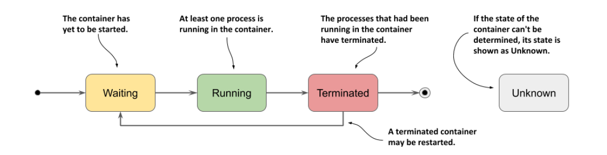

# Managing the lifecycle of the Pod

After you create a pod object and it runs, you can see what’s going on with the pod by reading the pod object back from the API.

A pod’s status section contains the following information:
- the IP addresses of the pod and the worker node that hosts it
- when the pod was started
- the pod’s quality-of-service (QoS) class
- what phase the pod is in,
- the conditions of the pod, and
- the state of its individual containers.

Run the pod:
- `cd ~/docker-k8s/19_Managing_the_lifecycle_of_the_Pod/examples`
- `kubectl apply -f 01_example.yaml`

## Understanding the pod's status
In any moment of the pod’s life, it’s in one of the five phases:

<!-- Vir: https://livebook.manning.com/book/kubernetes-in-action-second-edition -->

- **Pending**: After you create the Pod object, this is its initial phase. Until the pod is scheduled to a node and the images of its containers are pulled and started, it remains in this phase.
- **Running**: At least one of the pod’s containers is running.
- **Succeeded**: Pods that aren’t intended to run indefinitely are marked as Succeeded when all their containers complete successfully.
- **Failed**: When a pod is not configured to run indefinitely and at least one of its containers terminates unsuccessfully, the pod is marked as Failed.
- **Unknown**: The state of the pod is unknown because the Kubelet has stopped reporting communicating with the API server. Possibly the worker node has failed or has disconnected from the network.

The **pod’s phase** is one of the fields in the pod object’s status section. You can see it by displaying its manifest and optionally grepping the output to search for the field: 
- `kubectl get pod myapp -o yaml | grep phase`

You can also see the pod’s phase using kubectl describe:
- `kubectl describe pod myapp | grep Status:`

## Understanding pod conditions
A pod’s conditions indicate whether a pod has reached a certain state or not, and why that’s the case. In contrast to the phase, a pod has several conditions at the same time.
- **PodScheduled**: Indicates whether or not the pod has been scheduled to a node.
- **Initialized** The pod’s init containers have all completed successfully.
- **ContainersReady**: All containers in the pod indicate that they are ready. This is a necessary but not sufficient condition for the entire pod to be ready.
- **Ready**: The pod is ready to provide services to its clients. The containers in the pod and the pod’s readiness gates are all reporting that they are ready.

Each condition is either fulfilled or not.

<!-- Vir: https://livebook.manning.com/book/kubernetes-in-action-second-edition -->

To see the conditions of a pod, you can use kubectl describe as in the next listing:
- `kubectl describe pod myapp | grep Conditions: -A5`

To find out why a condition is false, you must inspect the pod manifest, as shown in the next listing.
- `kubectl get po myapp -o json | jq .status.conditions`

## Understanding the status of the containers
Also contained in the status of the pod is the status of each of its containers. Inspecting the status provides better insight into the operation of each individual container.

The most important part of a container’s status is its state. A container can be in one of the states shown in the following figure.

<!-- Vir: https://livebook.manning.com/book/kubernetes-in-action-second-edition -->

- **Waiting**: The container is waiting to be started. The `reason` and `message` fields indicate why the container is in this state.
- **Running**: The container has been created and processes are running in it. The `startedAt` field indicates the time at which this container was started.
- **Terminated**: The processes that had been running in the container have terminated. The `startedAt` and `finishedAt` fields indicate when the container was started and
when it terminated. The exit code with which the main process terminated is in the
exitCode field.
- **Unknown**: The state of the container couldn’t be determined.

Inspecting a container’s status using kubectl describe:
- `kubectl describe pod myapp | grep Containers: -A15`
- `kubectl delete pod --all`

## Keeping containers healthy
When a pod is scheduled to a node, the Kubelet on that node starts its containers and from then on keeps them running for as long as the pod object exists. **If the main process in the container terminates for any reason**, the Kubelet restarts the container.
