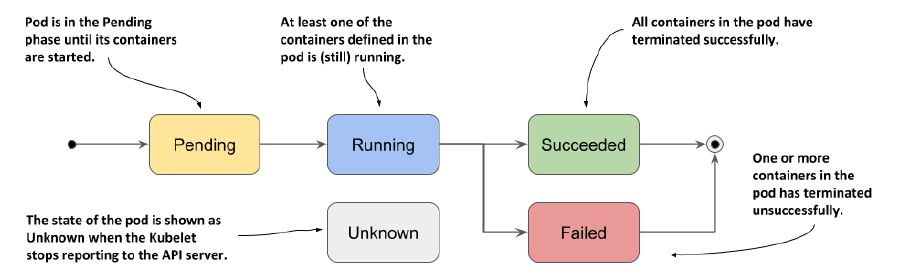
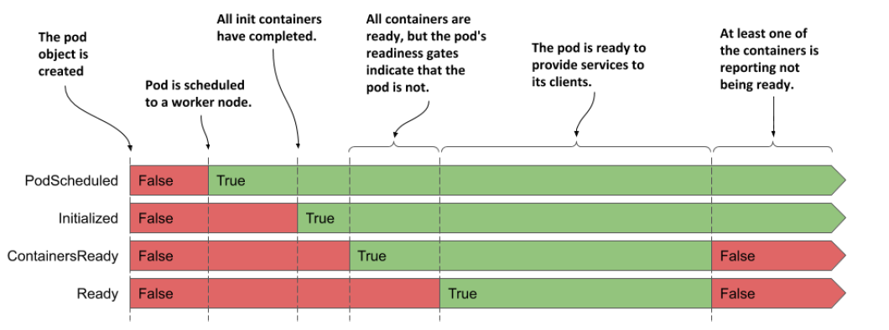

# Managing the lifecycle of the Pod

After you create a pod object and it runs, you can see what’s going on with the pod by reading the pod object back from the API.

A pod’s status section contains the following information:
- the IP addresses of the pod and the worker node that hosts it
- when the pod was started
- the pod’s quality-of-service (QoS) class
- what phase the pod is in,
- the conditions of the pod, and
- the state of its individual containers.

Run the pod:
- `cd ~/docker-k8s/19_Managing_the_lifecycle_of_the_Pod/examples`
- `kubectl apply -f 01_example.yaml`

## Understanding the pod's status
In any moment of the pod’s life, it’s in one of the five phases:

<!-- Vir: https://livebook.manning.com/book/kubernetes-in-action-second-edition -->

- **Pending**: After you create the Pod object, this is its initial phase. Until the pod is scheduled to a node and the images of its containers are pulled and started, it remains in this phase.
- **Running**: At least one of the pod’s containers is running.
- **Succeeded**: Pods that aren’t intended to run indefinitely are marked as Succeeded when all their containers complete successfully.
- **Failed**: When a pod is not configured to run indefinitely and at least one of its containers terminates unsuccessfully, the pod is marked as Failed.
- **Unknown**: The state of the pod is unknown because the Kubelet has stopped reporting communicating with the API server. Possibly the worker node has failed or has disconnected from the network.

The **pod’s phase** is one of the fields in the pod object’s status section. You can see it by displaying its manifest and optionally grepping the output to search for the field: 
- `kubectl get pod myapp -o yaml | grep phase`

You can also see the pod’s phase using kubectl describe:
- `kubectl describe pod myapp | grep Status:`

## Understanding pod conditions
A pod’s conditions indicate whether a pod has reached a certain state or not, and why that’s the case. In contrast to the phase, a pod has several conditions at the same time.
- **PodScheduled**: Indicates whether or not the pod has been scheduled to a node.
- **Initialized** The pod’s init containers have all completed successfully.
- **ContainersReady**: All containers in the pod indicate that they are ready. This is a necessary but not sufficient condition for the entire pod to be ready.
- **Ready**: The pod is ready to provide services to its clients. The containers in the pod and the pod’s readiness gates are all reporting that they are ready.

Each condition is either fulfilled or not.

<!-- Vir: https://livebook.manning.com/book/kubernetes-in-action-second-edition -->

To see the conditions of a pod, you can use kubectl describe as in the next listing:
- `kubectl describe pod myapp | grep Conditions: -A5`

To find out why a condition is false, you must inspect the pod manifest, as shown in the next listing.
- `kubectl get po myapp -o json | jq .status.conditions`

## Understanding the status of the containers
Also contained in the status of the pod is the status of each of its containers. Inspecting the status provides better insight into the operation of each individual container.

The most important part of a container’s status is its state. A container can be in one of the states shown in the following figure.

<!-- Vir: https://livebook.manning.com/book/kubernetes-in-action-second-edition -->

- **Waiting**: The container is waiting to be started. The `reason` and `message` fields indicate why the container is in this state.
- **Running**: The container has been created and processes are running in it. The `startedAt` field indicates the time at which this container was started.
- **Terminated**: The processes that had been running in the container have terminated. The `startedAt` and `finishedAt` fields indicate when the container was started and
when it terminated. The exit code with which the main process terminated is in the
exitCode field.
- **Unknown**: The state of the container couldn’t be determined.

Inspecting a container’s status using kubectl describe:
- `kubectl describe pod myapp | grep Containers: -A15`
- `kubectl delete pod --all`

## Keeping containers healthy
When a pod is scheduled to a node, the Kubelet on that node starts its containers and from then on keeps them running for as long as the pod object exists. **If the main process in the container terminates for any reason**, the Kubelet restarts the container.

If an error in your application causes it to crash, Kubernetes automatically restarts it, so even without doing anything special in the application itself, running it in **Kubernetes automatically gives it the ability to heal itself**.

Create the myapp-ssh pod again and enable communication with the pod by running the following two commands:
- `cd ~/docker-k8s/19_Managing_the_lifecycle_of_the_Pod/examples`
- `kubectl apply -f 02_example-ssl.yaml`
- `kubectl port-forward myapp-ssl 8080 8443 9901` (Run the following command in a local terminal)
- Run the following command in a separate terminal so you can see how the pod’s
status changes when one of its containers terminates:
    - `kubectl get pods -w`
    - `kubectl get events -w`

> You could emulate a crash of the container’s main process by sending it the KILL signal, but you can’t do this from inside the container because the Linux Kernel doesn’t let you kill the root process (the process with PID 1).

Envoy’s administration interface allows you to stop the process via its HTTP API. Open the URL `http://localhost:9901` in your browser and click the `quitquitquit` button.

The listing shows that the pod’s STATUS changes from Running to NotReady, while the READY column indicates that only one of the two containers is ready. Immediately thereafter, Kubernetes restarts the container and the pod’s status returns to Running. The RESTARTS column indicates that one container has been restarted.

> If one of the pod’s containers fails, the other containers continue to run.

**Kubernetes never restarts a container, but instead discards it and creates a new container.** Regardless, we call this restarting a container.

Any data that the process writes to the container’s filesystem is lost when the container is recreated. This behavior is sometimes undesirable. To persist data, you must add a storage volume to the pod.

If init containers are defined in the pod and one of the pod’s regular containers is restarted, the init containers are not executed again.

### Configuring the pod’s restart policy

By default, Kubernetes restarts the container regardless of whether the process in the container exits with a zero or non-zero exit code - in other words, whether the container completes successfully or fails.

Three restart policies exist:
- **Always**: Container is restarted regardless of the exit code the process in the container terminates with. This is the default restart policy.
- **OnFailure**: The container is restarted only if the process terminates with a non-zero exit code, which by convention indicates failure.
- **Never**: The container is never restarted - not even when it fails.

> The restart policy is configured at the pod level and applies to all its containers. It can’t be configured for each container individually.

<!-- Vir: https://livebook.manning.com/book/kubernetes-in-action-second-edition -->

### Understanding the time delay inserted before a container is restarted

If you call Envoy’s `/quitquitquit` endpoint several times, you’ll notice that each time it takes longer to restart the container after it terminates. The pod’s status is displayed as either NotReady or CrashLoopBackOff. 

The first time a container terminates, it is restarted immediately. The next time, however, Kubernetes waits ten seconds before restarting it again. This delay is then doubled to 20, 40, 80 and then to 160 seconds after each subsequent termination. From then on, the delay is kept at five minutes. This delay that doubles between attempts is called exponential back-off. In the worst case, a container can therefore be prevented from starting for up to five minutes.

<!-- Vir: https://livebook.manning.com/book/kubernetes-in-action-second-edition -->

> The delay is reset to zero when the container has run successfully for 10 minutes. If the container must be restarted later, it is restarted immediately.

- `kubectl delete pod myapp-ssl`

## Liveness probes

- [Configure Liveness, Readiness and Startup Probes](https://kubernetes.io/docs/tasks/configure-pod-container/configure-liveness-readiness-startup-probes/)

Applications can also become unresponsive without terminating. For example, a Java application with a memory leak eventually starts spewing out OutOfMemoryErrors, but its JVM process continues to run. Ideally, Kubernetes should detect this kind of error and restart the container.

**Kubernetes can be configured to check whether an application is still alive by defining a liveness probe.**

You can specify a liveness probe for each container in the pod. Kubernetes runs the probe periodically to ask the application if it’s still alive and well. If the application doesn’t respond, an error occurs, or the response is negative, the container is considered unhealthy and is terminated. The container is then restarted if the restart policy allows it.

> Liveness probes can only be used in the pod’s regular containers. 

Kubernetes can probe a container with one of the following three mechanisms:
- An **HTTP GET probe** sends a GET request to the container’s IP address, on the network port and path you specify. If the probe receives a response, and the response code doesn’t represent an error (in other words, if the HTTP response code is 2xx or 3xx), the probe is considered successful. If the server returns an error response code, or if it doesn’t respond in time, the probe is considered to have failed.
- A **TCP Socket probe** attempts to open a TCP connection to the specified port of the container. If the connection is successfully established, the probe is considered successful. If the connection can’t be established in time, the probe is considered
failed.
- An **Exec probe** executes a command inside the container and checks the exit code it terminates with. If the exit code is zero, the probe is successful. A non-zero exit code is considered a failure. The probe is also considered to have failed if the command fails to terminate in time.

Add a liveness probe to each of the containers in the myapp-ssl pod. Because they both run applications that understand HTTP, it makes sense to use an HTTP GET probe in each of them. The Node.js application doesn’t provide any endpoints to explicitly check the health of the application, but the Envoy proxy does.

Run:
- `cd ~/docker-k8s/19_Managing_the_lifecycle_of_the_Pod/examples`
- `cat 03_liveness.yaml`

The first probe doesn’t specify any other fields, so the default settings are used. The first request is sent 10s after the container starts and is repeated every 10s. If the application doesn’t respond within one second, the probe attempt is considered failed. If it fails three times in a row, the container is considered unhealthy and is terminated.

The administration interface of the Envoy proxy provides the special endpoint `/ready` through which it exposes its health status. Instead of targeting port 8443, which is the port through which Envoy forwards HTTPS requests to Node.js, the liveness probe for the envoy container targets this special endpoint on the admin port, which is port number 9901.

<!-- Vir: https://livebook.manning.com/book/kubernetes-in-action-second-edition -->

Run:
- `kubectl apply -f 03_liveness.yaml`
- `kubectl port-forward myapp-liveness 8080 8443 9901` (Run the following command in a local terminal)
- Run the following command in a separate terminal so you can see how the pod’s
status changes when one of its containers terminates:
    - `kubectl get pods -w`
    - `kubectl get events -w`

The only indication that Kubernetes is executing the probe is found in the container logs.
- `kubectl logs myapp-liveness -c myapp -f`

To display the Envoy’s log file, you use the following command:
- `kubectl exec myapp-liveness -c envoy -- tail -f /var/log/envoy.admin.log`

A successful liveness probe isn’t interesting, so let’s cause Envoy’s liveness probe to fail. Using Envoy’s administration interface, you can configure its health check endpoint to succeed or fail.

Immediately after executing the command, observe the events that are displayed in the other terminal. When the probe fails, a Warning event is recorded, indicating the error and the HTTP status code returned.

You can make the liveness probe succeed again by clicking the healthcheck/ok button in Envoy’s admin interface.

Remove the pod:
- `kubectl delete pod myapp-liveness`

## Startup probes

The default liveness probe settings give the application between 20 and 30 seconds to start responding to liveness probe requests. If the application takes longer to start, it is restarted and must start again. 

**To deal with the discrepancy between the start and the steady-state operation of an application, Kubernetes also provides startup probes.**

If a startup probe is defined for a container, only the startup probe is executed when the container is started. The startup probe can be configured to take into account the slow start of the application. When the startup probe succeeds, Kubernetes switches to using the liveness probe, which is configured to quickly detect when the application becomes unhealthy.

Imagine that the myapp Node.js application needs more than a minute to warm up, but you want it to be restarted within 10 seconds after it has become unhealthy during normal operation.

- `cat 04_startup.yaml`

Unlike liveness probes, it’s perfectly **normal for a startup probe to fail**. A failure only indicates that the application hasn’t yet been completely started. A successful startup probe indicates that the application has started successfully, and Kubernetes should switch to the liveness probe. The liveness probe is then typically executed using a shorter period of time, which allows for faster detection of non-responsive applications.

<!-- Vir: https://livebook.manning.com/book/kubernetes-in-action-second-edition -->

Usually, the startup and liveness probes are configured to use the same HTTP endpoint, but different endpoints can be used. You can also configure the startup probe as an `exec` or `tcpSocket` probe instead of an httpGet probe.

Run:
- `kubectl apply -f 04_startup.yaml`
- Remove the pod:
    - `kubectl delete pod myapp-startup-probe`

To provide a better liveness check, web applications typically expose a specific healthcheck endpoint, such as `/healthz`. When this endpoint is called, the application performs an internal status check of all the major components running within the application to ensure that none of them have died or are no longer doing what they should.

Make sure that the application checks only the operation of its internal components and nothing that is influenced by an external factor.

The handler invoked by a liveness probe shouldn’t use too much computing resources and shouldn’t take too long to complete. By default, probes are executed relatively often and only given one second to complete.

## Lifecycle hooks

