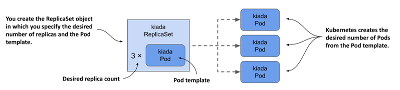

# Replicating Pods

## Introducing ReplicaSets

In a production cluster, you might need to deploy dozens or even hundreds of copies of the same Pod, so creating and managing those Pods would be difficult. Fortunately, in Kubernetes, you can **automate the creation and management of Pod replicas with the ReplicaSet object.**

> Before ReplicaSets were introduced, similar functionality was provided by the ReplicationController object type, which is now deprecated.

A **ReplicaSet represents a group of Pod replicas** (exact copies of a Pod). Instead of creating Pods one by one, you can create a ReplicaSet object in which you specify a Pod template and the desired number of replicas.

Even if you only need to create a single Pod, it’s better to do it through a ReplicaSet than to create it directly, because the ReplicaSet ensures that the Pod is always there to do its job.

