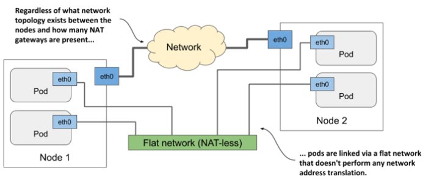
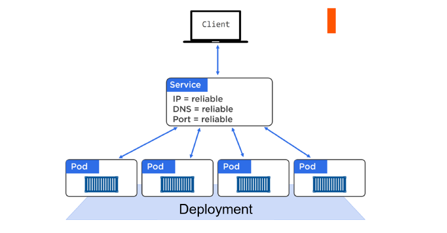
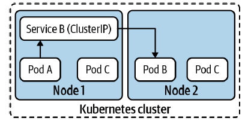
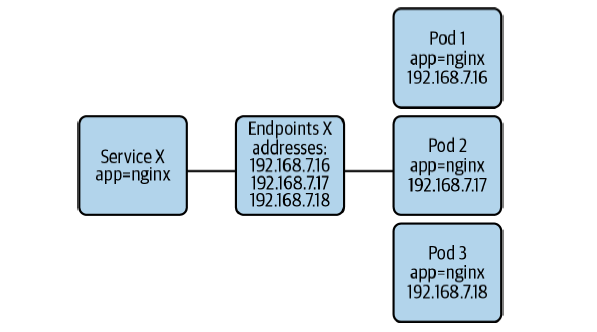
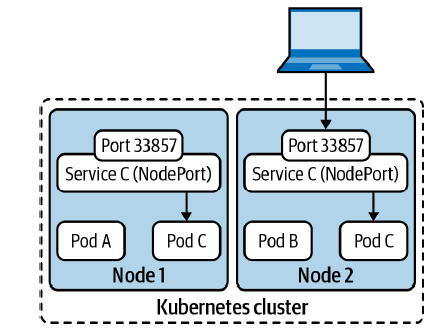
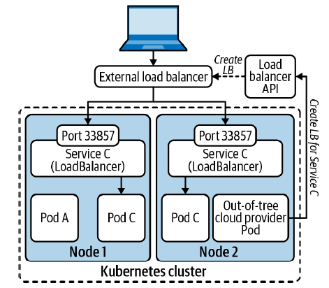

# Services, Load Balancing, and Networking

Many applications these days are meant to respond to external requests. For example, in the case of microservices, pods will usually respond to HTTP requests coming either **from other pods** inside the cluster or **from clients outside the cluster**.

Unlike in the non-Kubernetes world, where a sysadmin would configure each client app by specifying the exact IP address or hostname of the server providing the service in the client’s configuration files, doing the same in Kubernetes wouldn’t
work, because:
- Pods are ephemeral
- Kubernetes assigns an IP address to a pod after the pod has been scheduled to a node and before it’s started
- Horizontal scaling means multiple pods may provide the same service

To solve these problems, Kubernetes also provides another resource type - **Services**.

## Understanding how pods communicate
Each pod has its own network interface with its own IP address. **All pods in the cluster are connected by a single private network with a flat address space.** Even if the nodes hosting the pods are geographically dispersed with many network routers in between, the pods can communicate over their own **flat network where no NAT (Network Address Translation) is required.** This pod network is typically a software-defined network that’s layered on top of the actual network that connects the nodes.

<!-- Vir: https://livebook.manning.com/book/kubernetes-in-action-second-edition -->

When a pod sends a network packet to another pod, neither SNAT (Source NAT) nor DNAT (Destination NAT) is performed on the packet. This means that the **source IP and port, and the destination IP and port, of packets exchanged directly between pods are never changed.** If the sending pod knows the IP address of the receiving pod, it can send packets to it. The receiving pod can see the sender’s IP as the source IP address of the packet.

Although there are many Kubernetes **network plugins, they must all behave as described above.** 

From the perspective of the applications, the actual network topology between the nodes isn’t important.

## Introducing services
**A Kubernetes Service is a resource you create to make a single, constant point of entry to a group of pods providing the same service.**

Each service has an IP address and port that never change while the service exists. Clients can open connections to that IP and port, and those connections are then routed to one of the pods backing that service.

This way, clients of a service don’t need to know the location of individual pods providing the service, allowing those pods to be moved around the cluster at any time.

> **Every Service gets its own stable IP address, its own stable DNS name, and its own stable port.**

With a Service in front of a set of Pods, the Pods can scale up and down, they can fail, and they can be updated, rolled back… and while events like these occur, the Service in front of them observes the changes and updates its list of healthy Pods. But it never changes the stable IP, DNS, and port that it exposes.

**Services are loosely coupled with Pods via labels and label selectors.** This is the same technology that loosely couples Deployments to Pods and is key to the flexibility provided by Kubernetes.

The **Service’s Pod selector determines the Pods that belong to the Service.** The Pod selector is a collection of key/value pairs that Kubernetes evaluates against Pods in the same Namespace as the Service. If a Pod has the same key/value pairs in their labels, Kubernetes adds the Pod’s IP address to the backend pool of the Service.

Kubernetes supports several types of Service. The default type is `ClusterIP`. A ClusterIP Service has a stable IP address and port that is only accessible from inside the cluster.

The Service does load balancing at the L3/L4 layers in the OSI model.

Example:
- `cd ~/docker-k8s/22_Services_Load_Balancing_and_Networking/examples`
- `kubectl apply -f 01_example.yaml`
- When the Deployment and the Service are deployed, the Service will select all 10 Pod replicas and provide them with a stable networking endpoint and load-balance traffic to them.
- `kubectl get deployment`
- `kubectl get rs`
- `kubectl get pods`
- `kubectl get service`

The list shows that the IP address assigned to the service. Because this is the **cluster IP**, it’s **only accessible from inside the cluster.** The primary purpose of services is exposing groups of pods to other pods in the cluster.

The ClusterIP is a **virtual IP address (VIP).**

Testing your service from within the cluster (You can execute the curl command inside one of your existing pods through the kubectl exec command.):
- `kubectl exec <POD_ID> -- curl -s http://<CLUSTER_IP>`
- `kubectl exec <POD_ID> -- curl -s http://myapp-svc` (All
Pods in the cluster are pre-programmed to know about the cluster’s DNS service, meaning all Pods are able to resolve Service names.) It does not work outside of the cluster.

As Pods come-and-go (scaling up and down, failures, rolling updates etc.), the Service dynamically updates its list of healthy matching Pods. It does this through a combination of the label selector and a construct called an Endpoints object.

The Endpoints resource sits between Services and Pods. 

**Each Service that is created, automatically gets an associated Endpoints object. All this Endpoints object is, is a dynamic list of all of the healthy Pods on the cluster that match the Service’s label selector.**

- `kubectl describe svc myapp-svc`

The Endpoints resource is like any other Kubernetes resource, so you can display its basic info with kubectl get:
- `kubectl get endpoints`

**How it works?**: Kubernetes is constantly evaluating the Service’s label selector against the current list of healthy Pods on the cluster. Any new Pods that match the selector get added to the Endpoints object, and any Pods that disappear get removed. This means the Endpoints object is always up to date. Then, when a Service is sending traffic to Pods, it queries its Endpoints object for the latest list of healthy matching Pods.

- `kubectl delete -f 01_example.yaml`

## Accessing Services from outside the cluster with NodePort Service

The NodePort Service is useful when you need to expose a Service to network clients outside of the cluster, such as existing applications running in VMs or users of a web application.

NodePort Service **exposes the Service on a port across all cluster nodes.** The **port is assigned randomly** from a configurable port range. Once assigned, all nodes in the cluster listen for connections on the given port.

The primary challenge with NodePort Services is that **clients need to know the Service’s node port number and the IP address of at least one cluster node** to reach the Service. This is problematic because nodes can fail or be removed from the cluster.

A common way to solve this challenge is to **use an external load balancer in front of the NodePort Service**. With this approach, clients don’t need to know the IP addresses of cluster nodes or the Service’s port number. Instead, the load balancer functions as the single entry point to the Service.

The downside to this solution is that you need to manage external load balancers and update their configuration constantly.

## Accessing Services from outside the cluster with LoadBalancer Service

The LoadBalancer Service builds upon the NodePort Service to address some of its downsides. At its core, the LoadBalancer Service is a NodePort Service under the hood. However, the LoadBalancer Service has additional functionality that is satisfied by a controller.

The **controller, also known as a cloud provider integration, is responsible for automatically gluing the NodePort Service with an external load balancer.** In other words, the controller takes care of creating, managing, and configuring external load balancers in response to the configuration of LoadBalancer Services in the cluster. The controller does this by interacting with APIs that provision or configure load balancers.

Kubernetes has built-in controllers for several cloud providers, including Amazon Web Services (AWS), Google Cloud, and Microsoft Azure.

## Ingress

Ingress handles **north-south routing in the cluster**. It serves as an **entry point into workloads running in the cluster**, mainly HTTP and HTTPS services. Ingress provides layer 7 load balancing capabilities that enable more granular traffic routing than Services. 

The load balancing of traffic is handled by an **Ingress controller**, which must be installed in the cluster. 

Ingress controllers leverage **proxy technologies such as Envoy, NGINX, or HAProxy**. The controller gets the Ingress configuration from the Kubernetes API and configures the proxy accordingly.

## Service Mesh (Advanced)

More [here](./service_mesh.md).

