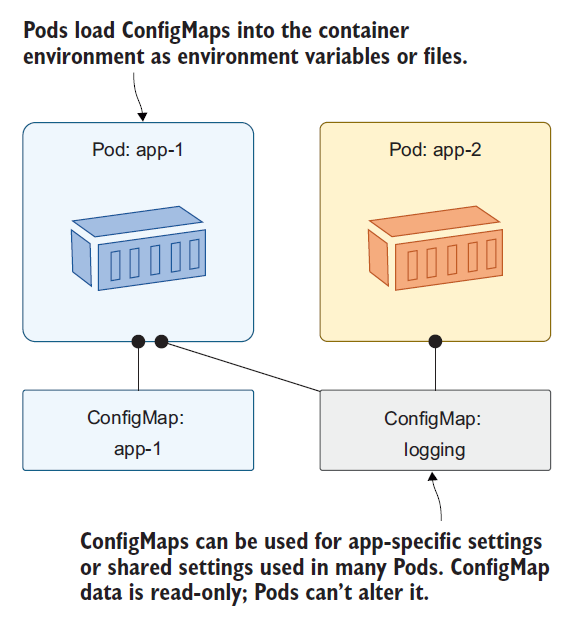

# Configuring applications with ConfigMaps and Secrets

## Configuring containerized applications
One of the great advantages of running apps in containers is that you **eliminate the gaps between environments**.

Almost all apps require configuration (settings that differ between deployed instances, credentials for accessing external systems, and so on), which **shouldn’t be baked into the built app itself**.

Cloud-native microservices applications should de-couple the application
and the configuration, bringing benefits such as:
- Re-usable application images
- Simpler testing
- Simpler and fewer disruptive changes

There are multiple ways of passing configuration options to a containerized application:
- Passing command-line arguments to containers
- Setting custom environment variables for each container
- Mounting configuration files into containers through a special type of volume

Kubernetes supports configuration injection with two resource types: ConfigMaps and Secrets. Though most configuration options don’t contain any **sensitive information**, several can. These include credentials, private encryption keys, and similar data that needs to be kept secure. This type of information needs to be handled with special care, which is why Kubernetes offers another type of first-class object called a **Secret**. 

Both types can store data in any reasonable format, and that data lives in the cluster independent of any other resources.

You **create ConfigMap and Secret objects** like other resources in Kubernetes—
using kubectl, either with create commands or by applying a YAML specification. Unlike other resources, **they don’t do anything**; they’re just **storage units intended for small amounts of data**. Those storage units can be loaded into a Pod, becoming part of the container environment, so the application in the container can read the data.

## Using environment variables in Kubernetes

Environment variables are a core operating system feature in Linux and Windows, and they can be set at the machine level so any app can read them. They’re commonly used, and all containers have some, which are set by the operating system inside the container and by Kubernetes.
- `cd 23_Configuring_applications_with_ConfigMaps_and_Secrets/examples/01_env_variables/`
- `sudo kubectl apply -f 01_sleep.yaml`
- `sudo kubectl wait --for=condition=Ready pod -l app=sleep`
- `sudo kubectl get pod`
- Check some of the environment variables in the Pod container: `sudo kubectl exec deploy/sleep -- printenv HOSTNAME NON_VALID_VARIABLE` (printenv is a Linux command that shows the value of environment variables. The HOSTNAME variable exists in all Pod containers and is set by Kubernetes to be the Pod name. The NON_VALID_VARIABLE variable doesn’t exist, so the command exits with an error code)

Many technology stacks use environment variables as a basic configuration system. The simplest way to provide those settings in Kubernetes is by adding environment variables in the Pod specification.
- `cat 02_sleep-with-env.yaml`
- Update the sleep Deployment with the new Pod spec: `sudo kubectl apply -f 02_sleep-with-env.yaml`
- Check the same environment variables in the new Pod: `sudo kubectl exec deploy/sleep -- printenv HOSTNAME NON_VALID_VARIABLE`

> Environment variables are static for the life of the Pod; **you can’t update any values while the Pod is running**. If you need to make configuration changes, you need to perform an update with a replacement Pod.

You should get used to the idea that deployments aren’t just for new feature releases; you’ll also use them for configuration changes and software patches, and you must **design your apps to handle frequent Pod replacements**.

The new app is using the same Docker image; it’s the same application with all the same binaries — only the configuration settings have changed between deployments.

Setting **environment values inline in the Pod specification is fine for simple settings**, but real applications usually have more complex configuration requirements, which is when you use ConfigMaps.

## Creating configmaps using the kubectl

**A ConfigMap is just a resource that stores some data that can be loaded into a Pod.** The data can be a set of key-value pairs, a blurb of text, or even a binary file. You can use key-value pairs to load Pods with environment variables, text to load any type of config file—JSON, XML, YAML, TOML, INI—and binary files to load license keys.

One Pod can use many ConfigMaps, and each ConfigMap can be used by many Pods.

<!-- Vir: Elton Stoneman - Learn Kubernetes in a Month of Lunches-Manning Publications (2021) -->

If you reference a ConfigMap in a Pod specification, **the ConfigMap needs to exist before you deploy the Pod**.

This spec expects to find a ConfigMap called `sleep-config-literal` with key-value pairs in the data, and the easiest way to create that is by passing the key and value to a kubectl command.
- `cat 03_sleep-with-configMap-env.yaml`
- Create a ConfigMap with data from the command line:
    - `sudo kubectl create configmap sleep-config-literal --from-literal=my-app-id='12345'`
> NOTE: ConfigMap keys must be a valid DNS subdomain (they may only contain alphanumeric characters, dashes, underscores, and dots). They may optionally include a leading dot.
- `sudo kubectl get cm sleep-config-literal` (check the ConfigMap details)
- `sudo kubectl describe cm sleep-config-literal` (show the friendly description of the ConfigMap)
- `sudo kubectl apply -f 03_sleep-with-configMap-env.yaml`
- `sudo kubectl exec deploy/sleep -- sh -c 'printenv'`

ConfigMaps usually contain more than one entry. To create a ConfigMap with multiple literal entries, you add multiple `--from-literal` arguments.

Creating ConfigMaps from literal values is fine for individual settings, but it **gets cumbersome fast if you have a lot of configuration data**. As well as specifying literal values on the command line, Kubernetes lets you load ConfigMaps from files.

## Storing and using configuration files in ConfigMaps

An **environment file** — a text file with key-value pairs can be
loaded to create one ConfigMap with multiple data items.
- `cd 23_Configuring_applications_with_ConfigMaps_and_Secrets/examples/02_config_maps/`
- `cat data.env`

Environment files are a useful way to group multiple settings, and Kubernetes has explicit support for loading them into ConfigMaps and surfacing all the settings as environment variables in a Pod container.

Create a new ConfigMap populated from the environment file, then deploy an update to the sleep app to use the new settings:
- Load an environment variable into a new ConfigMap: `sudo kubectl create configmap sleep-config-env-file --from-env-file=data.env`
- Check the details of the ConfigMap: `sudo kubectl get cm sleep-config-env-file`
- `sudo kubectl describe cm sleep-config-env-file`
- `cat 01_sleep-with-configMap-env-file.yaml`
- Update the Pod to use the new ConfigMap: `sudo kubectl apply -f 01_sleep-with-configMap-env-file.yaml`
- `sudo kubectl exec deploy/sleep -- sh -c 'printenv'`
- `sudo kubectl delete deployment sleep`

So the **environment variables defined with `env` in the Pod spec override the values defined with `envFrom` if there are duplicate keys**. It’s useful to remember that you can override any environment variables set in the container image or in ConfigMaps by explicitly setting them in the Pod spec — a **quick way to change a configuration setting** when you’re tracking down problems.

Environment variables are well supported, but most application platforms prefer a **more structured approach**.

Run a demo todo app. This run of the app will use all the default settings from the JSON configuration file in the image, except for the default logging level, which is set as an environment variable.
- `cd 23_Configuring_applications_with_ConfigMaps_and_Secrets/examples/03_config_maps_files`
- `cat 01_todo-web.yaml`
- `sudo kubectl apply -f 01_todo-web.yaml`
- `sudo kubectl wait --for=condition=Ready pod -l app=todo-web`
- Get the IP address of the app: `sudo kubectl get svc todo-web`
- Browse to the app and have a play around: `http://<IP>:8080/`
- Then try browsing to `/config`
- Check the application logs: `sudo kubectl logs -l app=todo-web`

In its current setup, it lets you add and view items, but there should also be a /config page we can use in nonproduction environments to view all the configuration settings. That page is empty, and the app logs a warning that someone tried to access it.

In Kubernetes, we can use the following configuration approach:
- **Default app settings are baked into the container image**. This could be just the settings which apply in every environment, or it could be a full set of configuration options, so without any extra setup, the app runs in development mode.
- The **actual settings for each environment are stored in a ConfigMap and surfaced into the container filesystem**. Kubernetes presents the configuration data as a file in a known location, which the app checks and merges with the content from the default file.
- Any **settings that need to be tweaked can be applied as environment variables** in the Pod specification for the Deployment.

The YAML specification for the development configuration of the todo app. 
- `cat todo-web-config-dev.yaml`

> NOTE: The pipeline character after the colon in the first line of both entries signals that a literal multi-line value follows.

It contains the contents of a JSON file, which the app will merge with the
default JSON configuration file in the container image, with a setting to make the config page visible. 

You **can embed any kind of text configuration file into a YAML spec**, as long as you’re careful with the whitespace. 

The ConfigMap definition contains just a single setting, but it’s stored in the native configuration format for the app. When we deploy an updated Pod spec, the setting will be applied and the config page will be visible.
- `sudo kubectl apply -f todo-web-config-dev.yaml`
- `sudo kubectl apply -f 02_todo-web-dev.yaml`
- Refresh your web browser at the `/config` page for your Service
- `sudo kubectl get pods`
- `sudo kubectl exec <POD_NAME> -- cat /app/config/config.json`

